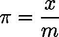
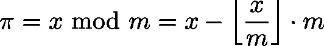
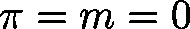

# fmod (FUN)

FUNCTION fmod : LREAL

This function will return the modulo of the integral division :

**Note**

The invalid input  will result in the return 0.

| InOut: | | Scope | Name | Type | Comment | | --- | --- | --- | --- | | Return | fmod | LREAL |  | | Input | lrX | LREAL | Dividend | | lrM | LREAL | Divisor | |

3.5.19.0

© Copyright 2025, CODESYS GmbH