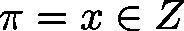
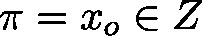

# Hysteresis\_DINT (FB)

FUNCTION\_BLOCK Hysteresis\_DINT

This function block will set the output variable to TRUE, if the integral value  is smaller than an integral lower bound 

It will set the Boolean output variable to FALSE, if the input value  exceeds the integral upper bound .

If  lies between the lower and upper bound, the value of the output will rest unchanged by the module.

| InOut: | | Scope | Name | Type | Comment | | --- | --- | --- | --- | | Input | diValue | DINT | input value | | diLimitPos | DINT | upper bound | | diLimitNeg | DINT | lower bound | | Output | xOut | BOOL | FALSE: If  TRUE: If  “xOut” else | |

3.5.19.0

© Copyright 2025, CODESYS GmbH