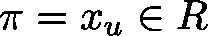

# Hysteresis\_LREAL (FB)

FUNCTION\_BLOCK Hysteresis\_LREAL

This function block will set the output variable to TRUE, if the input value  is smaller than a lower bound .

It will set the output variable to FALSE, if the input value  exceeds the upper bound .

If  lies between the lower and the upper bound, the value of the output variable will rest unchanged by the module.

| InOut: | | Scope | Name | Type | Comment | | --- | --- | --- | --- | | Input | lrValue | LREAL | input value | | lrLimitPos | LREAL | upper bound | | lrLimitNeg | LREAL | lower bound | | Output | xOut | BOOL | FALSE: If  TRUE: If  “xOut” else | |

3.5.19.0

© Copyright 2025, CODESYS GmbH