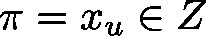

# LimitAlarm\_DINT (FB)

FUNCTION\_BLOCK LimitAlarm\_DINT

This function block checks whether an integral value  lies between an integral lower bound  and an integral upper bound .

The output value will be set according to the result.

| InOut: | | Scope | Name | Type | Comment | | --- | --- | --- | --- | | Input | diValue | DINT | value  to be tested | | diLimitPos | DINT | upper bound | | diLimitNeg | DINT | lower bound | | Output | xExceedsPos | BOOL | TRUE: If  FALSE: Else | | xExceedsNeg | BOOL | TRUE: If  FALSE: Else | | xInLimits | BOOL | TRUE: If  FALSE: Else, also in the atypical case | |

3.5.19.0

© Copyright 2025, CODESYS GmbH