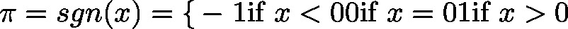

# sgn (FUN)

FUNCTION sgn : INT

This function will return the result of the signum function applied to input value :

| InOut: | | Scope | Name | Type | Comment | | --- | --- | --- | --- | | Return | sgn | INT |  | | Input | lr | LREAL | input value | |

3.5.19.0

© Copyright 2025, CODESYS GmbH