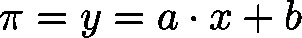
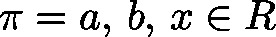

# CalcRootLin (FB)

FUNCTION\_BLOCK CalcRootLin

By use of this function block the root of a linear function  with , if there is one, will be calculated.

| InOut: | | Scope | Name | Type | Comment | | --- | --- | --- | --- | | Input | lrParam1 | LREAL | gradient of straight line (corresponds to ) | | lrParam0 | LREAL | height at which line cuts the vertical y-axis (corresponds to ) | | Output | byRoots | BYTE | number of roots  0: If line is parallel, but not identical to horizontal x-axis | 255: If line is identical to x-axis  1: Else | | lrRoot | LREAL | root | |

3.5.19.0

© Copyright 2025, CODESYS GmbH