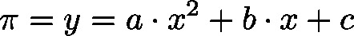
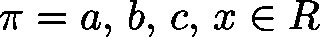

# CalcRootParable (FB)

FUNCTION\_BLOCK CalcRootParable

By use of this function block the root of a linear function  with , if there are some, are calculated.

| InOut: | | Scope | Name | Type | Comment | | --- | --- | --- | --- | | Input | lrParam2 | LREAL | multiplier of  (corresponds to ) | | lrParam1 | LREAL | multiplier of  (corresponds to ) | | lrParam0 | LREAL | multiplier of  (corresponds to ) | | Output | byRoots | BYTE | number of roots (0, 1, 2 or 255 in case of infinite roots) | | lrRoot0 | LREAL | first root | | lrRoot1 | LREAL | second root | |

3.5.19.0

© Copyright 2025, CODESYS GmbH