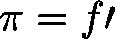
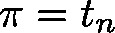
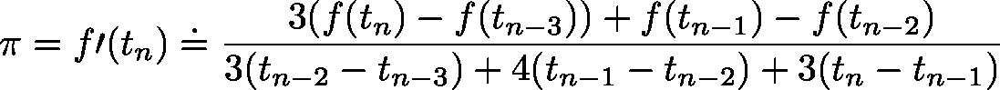

# Derivative (FB)

FUNCTION\_BLOCK Derivative

This function block will approximate the first derivative  of a function  at the actual time  with the respect to the values of the last three function calls according to the BDF method:

| InOut: | | Scope | Name | Type | Comment | | --- | --- | --- | --- | | Input | xEnable | BOOL | reset | | lrInputValue | LREAL | actual function value | | udiTM | UDINT | length of time interval  (equals time passed since last call to function) | | Output | lrDerivative | LREAL | approxmated value of first derivative | | xValid | BOOL | Validity of result  FALSE: If the number of calls neccessary for approximating has not been executed yet. | |

3.5.19.0

© Copyright 2025, CODESYS GmbH