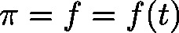
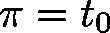
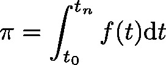
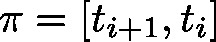
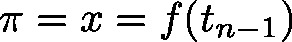
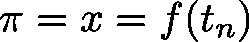
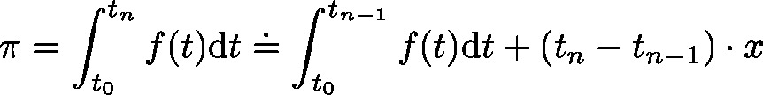

# Integral (FB)

FUNCTION\_BLOCK Integral

This function block will approximate the integral function of the fuction  over the time interval between the first function call  and the actual time : . The size of the time intervals  are integers and measured in micro seconds. The approximation is carried out by use of the explicit () resp. implicit () Euler method:

| InOut: | | Scope | Name | Type | Initial | Comment | | --- | --- | --- | --- | --- | | Input | xEnable | BOOL |  | reset | | lrInputValue | LREAL |  | function value (corresponds to :math`x`) | | udiTM | UDINT |  | size of time interval  (equals time passed since last call to function) | | Output | lrIntegral | LREAL |  | approximated value of integral | | xOverflow | BOOL | FALSE | error flag  TRUE: If an overflow has occured | |

3.5.19.0

© Copyright 2025, CODESYS GmbH