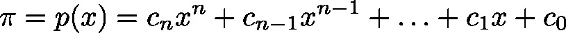
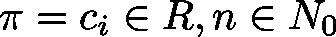
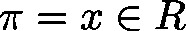

# PolynomialValue (FUN)

FUNCTION PolynomialValue : LREAL

This function block evaluates a given polynomial of arbitrary degree,  with  at a point  by use of the Horner scheme.

| InOut: | | Scope | Name | Type | Comment | | --- | --- | --- | --- | | Return | PolynomialValue | LREAL |  | | Input | siDegree | SINT | degree of polynomial | | plr | POINTER TO LREAL | pointer to Array of polynomial coefficients; at first there is the coefficient of the monomial of highest degree (corresponds to  in the formula) | | lrValue | LREAL | point , where polynomial has to be evaluated | |

3.5.19.0

© Copyright 2025, CODESYS GmbH