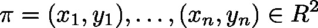

# CharCurve\_LREAL (FB)

FUNCTION\_BLOCK CharCurve\_LREAL

This function block will evaluate a piecewise linear function (the characteristic curve) at an integral point . The characteristic curve is specified by a defined number of integral sampling points 

| InOut: | | Scope | Name | Type | Comment | | --- | --- | --- | --- | | Input | lrInputValue | LREAL | interpolation point | | usiNoPoints | USINT | number  of sampling points defining the characteristic curve () | | Inout | ap2lrPoints | ARRAY [0..10] OF [POINT2\_LREAL](b-6o8zAqxg__JtVjGi1VTk4tM-Q_point2-lreal.html#b_6o8zaqxg__jtvjgi1vtk4tm_q_point2_lreal_point2_lreal_struct) | array of  two dimensional sampling points  with | | Output | lrOutputValue | LREAL | interpolated value at point | | xError | BOOL | error flag | | wErrorID | WORD | information on error  0: No error  1: error within array of sampling points (i.e. the sampling points aren’t arranged in ascending order)  2: interpolation point diInputValue is outside of area covered by sampling points ()  4: invalid number of sampling points | |

3.5.19.0

© Copyright 2025, CODESYS GmbH