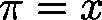

# ProjectPointOnLine (FUN)

FUNCTION ProjectPointOnLine : BOOL

This function will project the point  onto a straight line: thereby, the direction vector of the straight line is taken as normal vector of a plane that is moved along the line as long as it touches the point . The intersection point of the plane with the line corresponding to this location is the projected point.

| InOut: | | Scope | Name | Type | Comment | | --- | --- | --- | --- | | Return | ProjectPointOnLine | BOOL |  | | Input | pline | POINTER TO [LINE\_3D](b-6o8zAqxg__JtVjGi1VTk4tM-Q_line-3d.html#b_6o8zaqxg__jtvjgi1vtk4tm_q_line_3d_line_3d_struct) | Pointer on straight line | | pvOrig | POINTER TO [Vector3D](b-6o8zAqxg__JtVjGi1VTk4tM-Q_vector3d.html#b_6o8zaqxg__jtvjgi1vtk4tm_q_vector3d_vector3d_struct) | Pointer on point  to be projected | | pvProj | POINTER TO [Vector3D](b-6o8zAqxg__JtVjGi1VTk4tM-Q_vector3d.html#b_6o8zaqxg__jtvjgi1vtk4tm_q_vector3d_vector3d_struct) | Pointer to projected result | |

3.5.19.0

© Copyright 2025, CODESYS GmbH