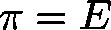
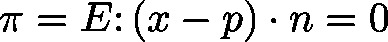
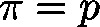

# CalcHesseRepresentation (FB)

FUNCTION\_BLOCK CalcHesseRepresentation

This function block will retrieve the normal form (due to Hesse) of a plane  in the three dimensional space: , where  is the normed normal on the plane and  a point on the plane. The plane is originally specified by three of its points.

| InOut: | | Scope | Name | Type | Comment | | --- | --- | --- | --- | | Input | vP1 | POINTER TO [Vector3D](b-6o8zAqxg__JtVjGi1VTk4tM-Q_vector3d.html#b_6o8zaqxg__jtvjgi1vtk4tm_q_vector3d_vector3d_struct) | point on plane | | vP2 | POINTER TO [Vector3D](b-6o8zAqxg__JtVjGi1VTk4tM-Q_vector3d.html#b_6o8zaqxg__jtvjgi1vtk4tm_q_vector3d_vector3d_struct) | point on plane | | vP3 | POINTER TO [Vector3D](b-6o8zAqxg__JtVjGi1VTk4tM-Q_vector3d.html#b_6o8zaqxg__jtvjgi1vtk4tm_q_vector3d_vector3d_struct) | point on plane | | Output | plane | [PLANE\_H](b-6o8zAqxg__JtVjGi1VTk4tM-Q_plane-h.html#b_6o8zaqxg__jtvjgi1vtk4tm_q_plane_h_plane_h_struct) | normal form of plane | | xError | BOOL | Error flag  TRUE: If input points are collinear | |

3.5.19.0

© Copyright 2025, CODESYS GmbH