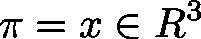

# ProjectPointOnPlane (FUN)

FUNCTION ProjectPointOnPlane : LREAL

This function will project a point  onto a plane in direction of the normal vector. The return is the distance of the point  to the plane.

| InOut: | | Scope | Name | Type | Comment | | --- | --- | --- | --- | | Return | ProjectPointOnPlane | LREAL |  | | Input | pplane | POINTER TO [Plane\_H](b-6o8zAqxg__JtVjGi1VTk4tM-Q_plane-h.html#b_6o8zaqxg__jtvjgi1vtk4tm_q_plane_h_plane_h_struct) | Pointer on plane description | | pvOrig | POINTER TO [VECTOR3D](b-6o8zAqxg__JtVjGi1VTk4tM-Q_vector3d.html#b_6o8zaqxg__jtvjgi1vtk4tm_q_vector3d_vector3d_struct) | Pointer on point  to be projected | | pvProj | POINTER TO [VECTOR3D](b-6o8zAqxg__JtVjGi1VTk4tM-Q_vector3d.html#b_6o8zaqxg__jtvjgi1vtk4tm_q_vector3d_vector3d_struct) | Pointer on projection of  onto plane | |

3.5.19.0

© Copyright 2025, CODESYS GmbH