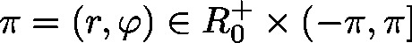
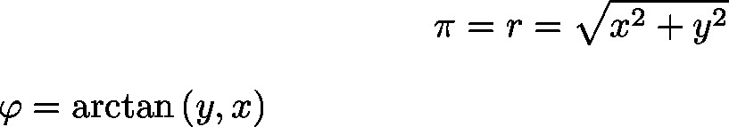

# CartesianToPolar (FB)

FUNCTION\_BLOCK CartesianToPolar

This function block will change the Cartesian coordinates of the two dimensional space , to polar coordinates , which are connected via:

| InOut: | | Scope | Name | Type | Comment | | --- | --- | --- | --- | | Input | lrX | LREAL | X coordinate | | lrY | LREAL | Y coordinate | | Output | lrAngle | LREAL | Angular coordinate  (azimuth) | | lrDistance | LREAL | Radius | |

3.5.19.0

© Copyright 2025, CODESYS GmbH