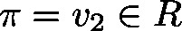
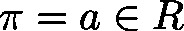
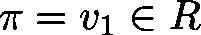
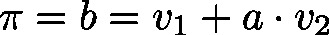

# AddMultiplicatedVector (FUN)

FUNCTION AddMultiplicatedVector : BOOL

This function will multiply the input vector  by a scalar  and will add this product to the input vector :

| InOut: | | Scope | Name | Type | Comment | | --- | --- | --- | --- | | Return | AddMultiplicatedVector | BOOL | The return value is not used. | | Input | pv1 | POINTER TO [Vector3d](b-6o8zAqxg__JtVjGi1VTk4tM-Q_vector3d.html#b_6o8zaqxg__jtvjgi1vtk4tm_q_vector3d_vector3d_struct) | Pointer to input vector | | pv2 | POINTER TO [Vector3d](b-6o8zAqxg__JtVjGi1VTk4tM-Q_vector3d.html#b_6o8zaqxg__jtvjgi1vtk4tm_q_vector3d_vector3d_struct) | Pointer to input vector | | lrFactor | LREAL | Scalar multiplier | | pv | POINTER TO [Vector3D](b-6o8zAqxg__JtVjGi1VTk4tM-Q_vector3d.html#b_6o8zaqxg__jtvjgi1vtk4tm_q_vector3d_vector3d_struct) | Pointer to result | |

3.5.19.0

© Copyright 2025, CODESYS GmbH