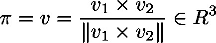

# CrossProductNormed (FB)

FUNCTION\_BLOCK CrossProductNormed

This function will calculate the Cartesian product of two vectors . The result will be returned in vector .

**Note**

Keep in mind that, due to rounding errors, the input of two collinear vectors will not necessarily result in the null vector.

| InOut: | | Scope | Name | Type | Comment | | --- | --- | --- | --- | | Input | v1 | [Vector3d](b-6o8zAqxg__JtVjGi1VTk4tM-Q_vector3d.html#b_6o8zaqxg__jtvjgi1vtk4tm_q_vector3d_vector3d_struct) | Input vector | | v2 | [Vector3d](b-6o8zAqxg__JtVjGi1VTk4tM-Q_vector3d.html#b_6o8zaqxg__jtvjgi1vtk4tm_q_vector3d_vector3d_struct) | Input vector | | Output | v | [Vector3D](b-6o8zAqxg__JtVjGi1VTk4tM-Q_vector3d.html#b_6o8zaqxg__jtvjgi1vtk4tm_q_vector3d_vector3d_struct) | Normed outer product | | xError | BOOL | Error flag  TRUE: If the calculated outer product yields the null vector so that scaling is not possible | |

3.5.19.0

© Copyright 2025, CODESYS GmbH