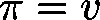

# MakeNormed3D (FUN)

FUNCTION MakeNormed3D : BOOL

This function will scale an input vector  to norm 1, as far as  is not the null vector.

| InOut: | | Scope | Name | Type | Comment | | --- | --- | --- | --- | | Return | MakeNormed3D | BOOL | TRUE: If  is not the null vector | | Input | pv | POINTER TO [VECTOR3D](b-6o8zAqxg__JtVjGi1VTk4tM-Q_vector3d.html#b_6o8zaqxg__jtvjgi1vtk4tm_q_vector3d_vector3d_struct) | Pointer to input vector | |

3.5.19.0

© Copyright 2025, CODESYS GmbH