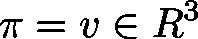

# Norm3D (FUN)

FUNCTION Norm3D : LREAL

This function will return the length/norm of a three dimensional vector 

| InOut: | | Scope | Name | Type | Comment | | --- | --- | --- | --- | | Return | Norm3D | LREAL | The length/norm of the input vector | | Input | pv | POINTER TO [VECTOR3D](b-6o8zAqxg__JtVjGi1VTk4tM-Q_vector3d.html#b_6o8zaqxg__jtvjgi1vtk4tm_q_vector3d_vector3d_struct) | Pointer to input vector | |

3.5.19.0

© Copyright 2025, CODESYS GmbH