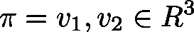

# ScalProd3DStand (FUN)

FUNCTION ScalProd3DStand : LREAL

This function will calculate the cosine of the angle being drawn by two input vectors .

| InOut: | | Scope | Name | Type | Comment | | --- | --- | --- | --- | | Return | ScalProd3DStand | LREAL | If one of the input vector equals the null vector, 0 will be returned. | | Input | pv1 | POINTER TO [Vector3d](b-6o8zAqxg__JtVjGi1VTk4tM-Q_vector3d.html#b_6o8zaqxg__jtvjgi1vtk4tm_q_vector3d_vector3d_struct) | Pointer to input vector | | pv2 | POINTER TO [Vector3d](b-6o8zAqxg__JtVjGi1VTk4tM-Q_vector3d.html#b_6o8zaqxg__jtvjgi1vtk4tm_q_vector3d_vector3d_struct) | Pointer to input vector | |

3.5.19.0

© Copyright 2025, CODESYS GmbH