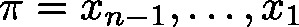
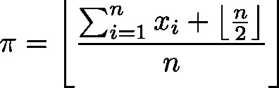

# Statistics\_DINT (FB)

FUNCTION\_BLOCK Statistics\_DINT

This function block will update the values of minimum, maximum and average with respect to the integral input parameter , which will be added to a set of integral data  (stemming from previous calls).

**Note**

Pay attention, that the returned average is of type DINT. In contrast to the arithmetic mean the result will be rounded.

| InOut: | | Scope | Name | Type | Initial | Comment | | --- | --- | --- | --- | --- | | Input | xEnable | BOOL |  | Reset | | diInput | DINT |  | New data | | Output | diMin | DINT | 16#7FFFFFFF | Minimum of set | | diMax | DINT | DWORD\_TO\_DINT(16#80000000) | Maximum of set | | diAverage | DINT |  | Rounded avarage of data | | xOverrun | BOOL |  | TRUE: In case of overflow  The module will compensate this by a minor weighting of the old data leading to inaccuracy of the result | |

3.5.19.0

© Copyright 2025, CODESYS GmbH