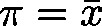
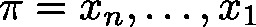
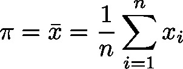

# Statistics\_LREAL (FB)

FUNCTION\_BLOCK Statistics\_LREAL

This function block will update the values of minimum, maximum and average with respect to the integral input parameter , which will be added to a set of integral data  (stemming from previous calls).

The arithmetic mean  of the values  is calculated by:

| InOut: | | Scope | Name | Type | Initial | Comment | | --- | --- | --- | --- | --- | | Input | xEnable | BOOL |  | Reset | | lrInput | LREAL |  | New data | | Output | lrMin | LREAL | LREAL#1E+80 | Minimum of set | | lrMax | LREAL | LREAL#-1E+80 | Maximum of set | | lrAverage | LREAL |  | Arithmetic mean of data | | xOverrun | BOOL |  | TRUE: In case of overflow  The module will compensate this by a minor weighting of the old data leading to inaccuracy of the result | |

3.5.19.0

© Copyright 2025, CODESYS GmbH