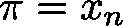
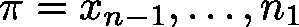
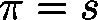
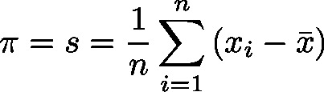

# Variance (FB)

FUNCTION\_BLOCK Variance

This function will update the experimental variance of the mean with respect to the new input parameter , which will be added to a series of data  (stemming from previous calls).

The variance  of the data  is calculated according to: , where  is the arithmetic mean of the data.

| InOut: | | Scope | Name | Type | Comment | | --- | --- | --- | --- | | Input | xEnable | BOOL | Reset | | lrInputValue | LREAL | New data | | Output | lrVariance | LREAL | Experimental variance of the mean of | |

3.5.19.0

© Copyright 2025, CODESYS GmbH