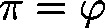

# atan2\_func (FUN)

FUNCTION atan2\_func : LREAL

This function will return the angle  (azimuth) necessary for changing Cartesian to polar coordinates.

| InOut: | | Scope | Name | Type | Comment | | --- | --- | --- | --- | | Return | atan2\_func | LREAL | The angle , whose sine and cosine correspond to the input values. | | Input | lrSinus | LREAL | Sine of angle | | lrCosinus | LREAL | Cosine of angle | |

3.5.19.0

© Copyright 2025, CODESYS GmbH