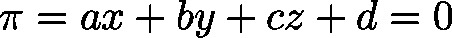
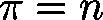

# PLANE\_H (STRUCT)

TYPE PLANE\_H : STRUCT

This structure defines a plane in the three dimensional space according to the normal form due to Hesse: , where  represents the normed normal of the plane.

| InOut: | | Name | Type | Comment | | --- | --- | --- | | lrNx | LREAL | component of a normal vector (corresponds to ) | | lrNy | LREAL | component of a normal vector (corresponds to ) | | lrNz | LREAL | component of a normal vector (corresponds to ) | | lrN | LREAL | distance to origin in consideration of the orientation of the normal vector (corresponds to ) | |

3.5.19.0

© Copyright 2025, CODESYS GmbH