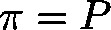

# POINT2\_LREAL (STRUCT)

TYPE POINT2\_LREAL : STRUCT

This structure defines a vector  of the two dimensional space by specifying the floating-point values of the x- and y-component of its target point .

| InOut: | | Name | Type | Comment | | --- | --- | --- | | lrX | LREAL | x-component of the target point (floating point) | | lrY | LREAL | y-component of the target point (floating point) | |

3.5.19.0

© Copyright 2025, CODESYS GmbH