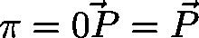

# VECTOR3D (STRUCT)

TYPE VECTOR3D : STRUCT

This structure defines a vector  of the three dimensional space by specifying the floating-point values of the x-, y- and z-component of its target point .

| InOut: | | Name | Type | Initial | Comment | | --- | --- | --- | --- | | dX | LREAL | 0 | x-component of target point (floating point, initialized with 0) | | dY | LREAL | 0 | y-component of target point (floating point, initialized with 0) | | dZ | LREAL | 0 | z-component of target point (floating point, initialized with 0) | |

3.5.19.0

© Copyright 2025, CODESYS GmbH