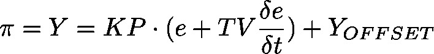

# PD (FB)

FUNCTION\_BLOCK PD

Represents a PD controller

A PD controller continuously calculates an error value e(t) as the difference between a desired set point and a measured process variable. The PD controller applies a correction based on proportional and derivative terms (sometimes denoted P and D respectively) which give their name to the controller type.

Y\_OFFSET, Y\_MIN and Y\_MAX are used for the transformation of the manipulated variable within a prescribed range. MANUAL can be used to switch on and off manual operation. RESET serves to reset the controller. In normal operation ( MANUAL = RESET = LIMITS\_ACTIVE = FALSE) the controller calculates the controller error e as difference SET\_POINT – ACTUAL, generates the derivation with respect to time  and stores these values internally.

The output, that is the manipulated variable Y, is calculated as follows: 

So besides the P-part also the current change of the controller error (D-part) influences the manipulated variable. Additionally Y is limited on a range prescribed by Y\_MIN and Y\_MAX. If Y exceeds these limits, LIMITS\_ACTIVE will get TRUE. If no limitation of the manipulated variable is desired, Y\_MIN and Y\_MAX have to be set to 0. As long as MANUAL=TRUE, Y\_MANUAL will be written to Y. A P controller can be easily created by setting TV=0.

For more information see: [PID](o2pf-m4Nz7ZPrBsrPW-xdt6Wid4_pid.html#o2pf_m4nz7zprbsrpw_xdt6wid4_pid_pid_fb).

| InOut: | | Scope | Name | Type | Initial | Comment | | --- | --- | --- | --- | --- | | Input | ACTUAL | REAL |  | Actual value, process variable | | SET\_POINT | REAL |  | Specified value, set point | | KP | REAL |  | Proportionality constant P | | TV | REAL |  | Rate time, derivative time D [sec]. If set to 0, than it works a P controller | | Y\_MANUAL | REAL |  | Y is set to this value as long as MANUAL = TRUE | | Y\_OFFSET | REAL |  | Offset for manipulated variable | | Y\_MIN | REAL |  | Minimum value for manipulated variable. If no limitation is desired, it must be be set to 0 | | Y\_MAX | REAL |  | Maximum value for manipulated variable. If no limitation is desired, it must be be set to 0 | | MANUAL | BOOL |  | TRUE: Manual: Y is not influenced by controller  FALSE: Controller determines Y | | RESET | BOOL |  | TRUE: Set Y output to Y\_OFFSET | | Output | Y | REAL |  | Manipulated variable, set value | | LIMITS\_ACTIVE | BOOL | FALSE | TRUE: Y has exceeded the given limits Y\_MIN, Y\_MAX and is limited to these values | |

3.5.21.0

© Copyright 2025, CODESYS GmbH