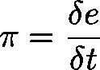
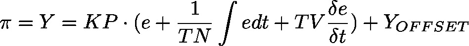

# PID (FB)

FUNCTION\_BLOCK PID

Represents a PID controller

**Note**

The PID controller itself measures the elapsed time between two calls, however with a maximum accuracy of milliseconds. This might lead to rough running in case of short cycle times: For example in case of a cycle time of 1ms the PID sometimes might measure 2 ms, sometimes 0 ms. So if possible, for such cases better use PID\_FIXCYCLE, where the cycle time can be set precisely. See [PID\_FIXCYCLE](o2pf-m4Nz7ZPrBsrPW-xdt6Wid4_pid-fixcycle.html#o2pf_m4nz7zprbsrpw_xdt6wid4_pid_fixcycle_pid_fixcycle_fb)

**Note**

Consider that the controller parameters only get applied when used in the manual mode at a start, a reset or at a change down.

A PID controller continuously calculates an error value e(t) as the difference between a desired set point and a measured process variable. The PID controller applies a correction based on proportional, integral, and derivative terms (sometimes denoted P, I, and D respectively) which give their name to the controller type.

* P accounts for present values of the error. For example, if the error is large and positive, the control output will also be large and positive.
* I accounts for past values of the error. For example, if the current output is not sufficiently strong, the integral of the error will accumulate over time, and the controller will respond by applying a stronger action.
* D accounts for possible future trends of the error, based on its current rate of change.[1]

As a PID controller relies only on the measured process variable, not on knowledge of the underlying process, it is broadly applicable. By tuning the three parameters of the model, a PID controller can deal with specific process requirements. The response of the controller can be described in terms of its responsiveness to an error, of the degree to which the system overshoots a setpoint, and of the degree of any system oscillation. The use of the PID algorithm does not guarantee optimal control of the system or even its stability.

Y\_OFFSET, Y\_MIN and Y\_MAX serve for transformation of the manipulated variable within a prescribed range. MANUAL can be used to switch to manual operation; RESET can be used to re-initialize the controller. In normal operation (MANUAL = RESET = LIMITS\_ACTIVE = FALSE) the controller calculates the controller error e as difference from SET\_POINT – ACTUAL, generates the derivation with respect to time  and stores these values internally.

The output Y is the manipulated variable unlike the PD controller contains an additional integral part, and is calculated as follows:  So besides the P-part also the current change of the controller error (D-part) and the history of the controller error (I-part) influence the manipulated variable. The PID controller can be easily converted to a PI-controller by setting TV=0. Because of the additional integral part, an overflow can come about by incorrect parameterization of the controller, if the integral of the error e becomes to great. Therefore for the sake of safety a BOOLean output called OVERFLOW is present, which in this case would have the value TRUE. This only will happen if the control system is instable due to incorrect parameterization. At the same time, the controller will be suspended and will only be activated again by re-initialization.

**Note**

As long as the limitation for the manipulated variable (Y\_MIN, Y\_MAX) is active, the integral part will be adapted, like if the history of the input values had automatically effected the limited output value. If this behaviour is not wanted, the following workaround is possible: Switch off the limitation at the PID controller (Y\_MIN>=Y\_MAX) and instead apply the LIMIT operator (IEC standard) on output value Y (see an example in the figure below).

**Note**

It is not necessary to readjust the controller parameters (KP, TN, TV) if the cycle time changes.

# Temperature control with PID and LIMIT

See in the following figure a simple example of using the PID module for temperature control and in combination with the LIMIT operator. The input of the actual temperature is simulated by giving a constant value via ActualTemperature.

| InOut: | | Scope | Name | Type | Initial | Comment | | --- | --- | --- | --- | --- | | Input | ACTUAL | REAL |  | Current value, process variable | | SET\_POINT | REAL |  | Desired value, set point | | KP | REAL |  | Proportionality const. P | | TN | REAL |  | Reset time I [sec] | | TV | REAL |  | Rate time, derivative time D [sec]. If set to 0, then it works as PI controller | | Y\_MANUAL | REAL |  | Y is set to this value as long as MANUAL = TRUE | | Y\_OFFSET | REAL |  | Offset for manipulated variable | | Y\_MIN | REAL |  | Minimum value for manipulated variable | | Y\_MAX | REAL |  | Maximum value for manipulated variable | | MANUAL | BOOL |  | TRUE: Manual: Y is not influenced by controller  FALSE: Controller determines Y | | RESET | BOOL |  | TRUE: Set Y output to Y\_OFFSET and reset integral part | | Output | Y | REAL |  | Manipulated variable, set value | | LIMITS\_ACTIVE | BOOL | FALSE | TRUE: Y has exceeded the given limits Y\_MIN, Y\_MAX and is limited to these values | | OVERFLOW | BOOL | FALSE | Overflow in integral part | |

3.5.21.0

© Copyright 2025, CODESYS GmbH