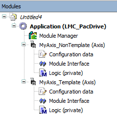

# SR\_<Axis Name> - General Information

## Overview

|  |  |
| --- | --- |
| Type: | Program |
| Available as of: | V2.0.0.0 |

This chapter provides information on:

* [Functional Description](#D-SE-0098147__D-SE-0098147.3)
* [Interface in Case of Node Type 'PacDrive 3 Template'](#D-SE-0098147__D-SE-0098147.25)
* [Interface in Case of Node Type 'Non Template'](#D-SE-0098147__D-SE-0098147.4)
* [Diagnostic Messages](#D-SE-0098147__D-SE-0098147.27)
* [Properties](#D-SE-0098147__D-SE-0098147.26)
* [Methods](#D-SE-0098147__D-SE-0098147.6)

## Functional Description

Smart Template Axis Module

## Interface in Case of Node Type 'PacDrive 3 Template'

| Input/Output | Data type | Description |
| --- | --- | --- |
| iq\_stAxisModuleInterface | [AXM.ST\_ModuleInterface](../../../../../api/crossBook?lang=en-US&virtualBookName=PD.Lib.AxisModule&topicID=D_SE_0077226) | Axis module specific parameters |
| iq\_stStandardModuleItf | [TPL.ST\_StandardModuleInterface](../../../../../api/crossBook?lang=en-US&virtualBookName=PD.Lib.Template&topicID=D_SE_0078570) | Standard module interface |
| iq\_stExceptionList | [TPL.ST\_ExceptionList](../../../../../api/crossBook?lang=en-US&virtualBookName=PD.Lib.Template&topicID=D_SE_0078550) | Exception list |
| iq\_stLogDataList | [TPL.ST\_LogDataList](../../../../../api/crossBook?lang=en-US&virtualBookName=PD.Lib.Template&topicID=D_SE_0078556) | Log data list |

## Interface in Case of Node Type 'Non Template'

| Input | Data type | Description |
| --- | --- | --- |
| i\_xEnable | BOOL | A rising edge FALSE -> TRUE activates the POU, a falling edge TRUE -> FALSE deactivates the POU.  A deactivated POU does not execute any action. |
| i\_xAsyncStop | BOOL | Initiate an immediate asynchronous stop. The process can no longer be accessed while the exception is pending. No commands can be executed while the reaction is pending. You may still execute certain special operating modes and commands required for exception elimination. |
| i\_xSyncStopEL | BOOL | Initiate a synchronous stop (monitored by a timeout = waits until the movement stops). Deactivates the process after the synchronous stop has been completed. The process can no longer be accessed while the exception is pending. If the timeout (configurable) is triggered, the function transitions to an asynchronous stop. |
| i\_xSyncStopEH | BOOL | Initiate a synchronous stop (monitored by a timeout = waits until the movement stops). Does NOT disable process after completion of the synchronous stop. |
| i\_xStopEndOfCycle | BOOL | Initiate a stop at the end of the cycle. Does NOT deactivate the process. |
| i\_xDiagQuit | BOOL | A rising edge FALSE -> TRUE cancels an active exception of the POU. |

| Output | Data type | Description |
| --- | --- | --- |
| q\_xActive | BOOL | TRUE: The POU is active. If the output is TRUE while the i\_xEnable is deactivated, the POU must first terminate its ongoing processing before transitioning this output to FALSE.  FALSE: The POU is inactive |
| q\_xReady | BOOL | TRUE: The POU is ready to operate and can accept user commands.  FALSE: The function block is not ready to accept user commands. |
| q\_etDiag | *[GD.ET\_Diag](../../../../../api/crossBook?lang=en-US&virtualBookName=PD.Lib.GlobalDiagnostic&topicID=D_SE_0076228)* | General library-independent statement on the diagnostic. A value unequal to GD.ET\_Diag.Ok corresponds to a diagnostic message. |
| q\_udiDiagExt | UDINT | POU-specific output on the diagnostic.  q\_etDiag = GD.ET\_Diag.Ok -> Status message  q\_etDiag <> GD.ET\_Diag.Ok -> Diagnostic message |
| q\_sDiagExt | STRING[80] | The name of the respective enumeration of q\_udiDiagExt as Description. |
| q\_sMsg | STRING[80] | Event-triggered message that gives more detailed information on the diagnostic state. |
| q\_xException | BOOL | An error was detected and an exception is active. |
| q\_xWarning | BOOL | An advisory is active. |
| q\_etActiveOpMode | [AXM.ET\_OpMode](../../../../../api/crossBook?lang=en-US&virtualBookName=PD.Lib.AxisModule&topicID=D_SE_0077130) | The active operating mode of the Smart Template axis module. |
| q\_xCmdActive | BOOL | A command is active. |
| q\_etCmdActive | [AXM.ET\_Cmd](../../../../../api/crossBook?lang=en-US&virtualBookName=PD.Lib.AxisModule&topicID=D_SE_0077124) | The active command of the Smart Template axis module. |
| q\_xCmdDone | BOOL | A command is terminated successfully. |
| q\_xAsyncStop | BOOL | An immediate asynchronous stop is active. The process can no longer be accessed while the exception is pending. No commands can be executed while the reaction is pending. You may still execute certain special operating modes and commands required for exception elimination. |
| q\_xSyncStopEL | BOOL | A synchronous stop (monitored by a timeout = waits until the movement stops) is active. Deactivates the process after the synchronous stop has been completed. The process can no longer be accessed while the exception is pending. If the timeout (configurable) is triggered, the function transitions to an asynchronous stop. |
| q\_xSyncStopEH | BOOL | A synchronous stop (monitored by a timeout = waits until the movement stops) is active. Does NOT disable process after completion of the synchronous stop. |
| q\_xStopEndOfCycle | BOOL | A stop at the end of the cycle is active. Does NOT deactivate the process. |

| Input/Output | Data type | Description |
| --- | --- | --- |
| iq\_etCmd | [AXM.ET\_Cmd](../../../../../api/crossBook?lang=en-US&virtualBookName=PD.Lib.AxisModule&topicID=D_SE_0077123) | Transfer a module command to the module. |
| iq\_stAxisModuleInterface | [AXM.ST\_ModuleInterface](../../../../../api/crossBook?lang=en-US&virtualBookName=PD.Lib.AxisModule&topicID=D_SE_0077226) | Axis module specific parameters. |

## Diagnostic Messages

The diagnostic messages are identical to the *[AXM.FB\_AxisModule](../../../../../api/crossBook?lang=en-US&virtualBookName=PD.Lib.AxisModule&topicID=D_SE_0077136)*.

## Properties

| Name | Data type | Accessing | Description |
| --- | --- | --- | --- |
| stStandardMotionInterface | [TPL.ST\_StandardMotionInterface](../../../../../api/crossBook?lang=en-US&virtualBookName=PD.Lib.Template&topicID=D_SE_0078573) | Read/write | Adapt the parameter for the different operation modes. |
| xHomingSensor | BOOL | Read/write | Input for homing on sensor. |
| xHwLimitSwitchNeg | BOOL | Read/write | Value for AXM.ST\_ModuleInterface.ST\_Main.i\_xHwLimitSwitchNeg. |
| xHwLimitSwitchPos | BOOL | Read/write | Value for AXM.ST\_ModuleInterface.ST\_Main.i\_xHwLimitSwitchPos. |

## Methods

| Name | Description |
| --- | --- |
| [Configuration](ConfigurationMethod-0F2571FF.html) | Configuration of the module. |
| [Logic](D-SE-0098149.html) | Logic for the axis. |
| [ModuleInterface](D-SE-0098148.html) | Data exchange with the Smart Template. |
| [RegisterLoggerPoint](D-SE-0098150.html) | Register the Smart Template Axis Module to the Application Logger. |

EIO0000003994.04