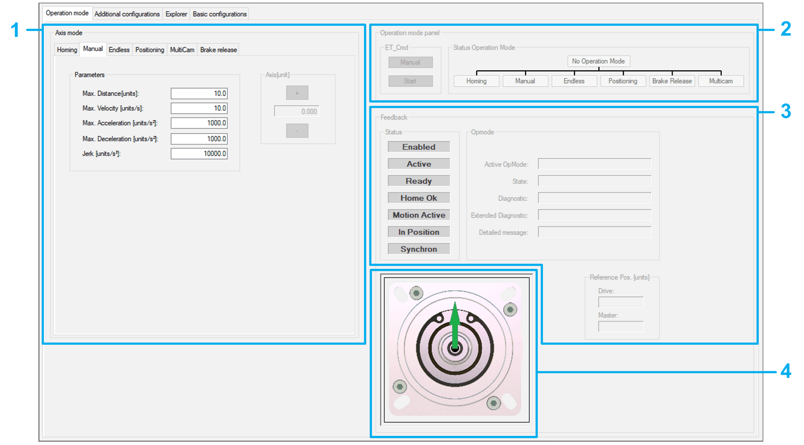

# Operation Mode - General

## Overview

Refer to the [*Smart Template Modules User Guide*](../../../../../api/crossBook?lang=en-US&virtualBookName=SmrtTplt&topicID=D_SE_0091270) for more information on displaying the different tabs.

The Operation mode tab provides four sections:

* [Axis mode (1)](D-SE-0098219.html#D-SE-0098219)
* [Operation mode panel (2)](D-SE-0098256.html#D-SE-0098256)
* [Feedback (3)](D-SE-0098257.html#D-SE-0098257)
* [Axis View (4)](D-SE-0098261.html#D-SE-0098261)

EIO0000003994.04