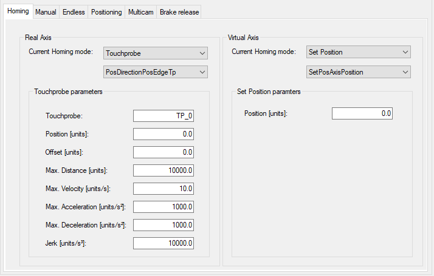
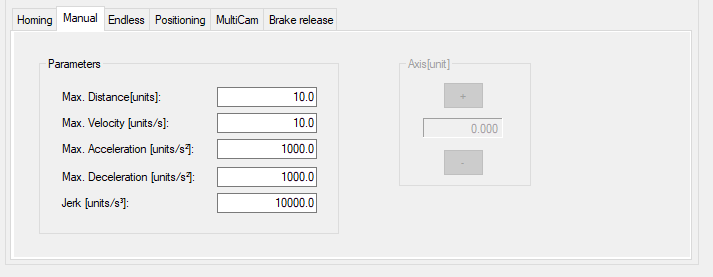
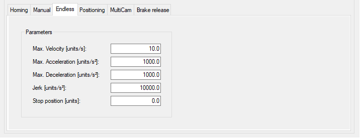
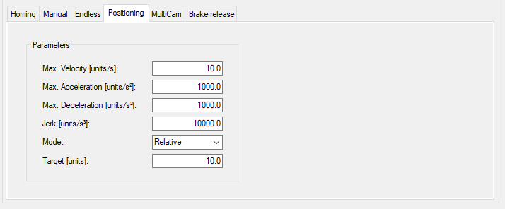
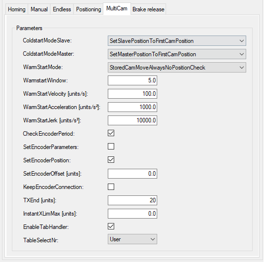
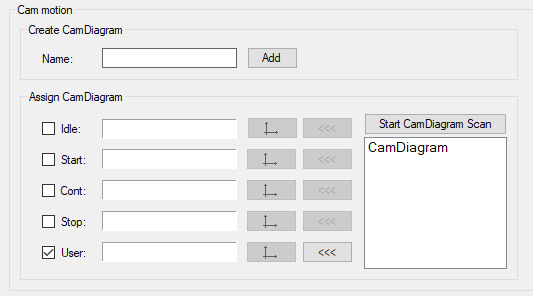
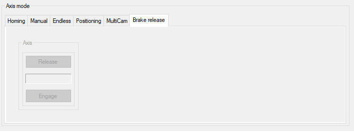

# Axis Mode

## Overview

The Axis mode section provides a tab for each operation mode:

* Homing
* Manual
* Endless
* Positioning
* MultiCam
* Brake release

## Homing Tab

The Homing tab allows you to select and parameterize the homing mode for a Real Axis (left-hand side) and for a Virtual Axis (right-hand side).

Selecting and parameterizing the homing mode for a Real Axis or for a Virtual Axis is done in the same way.

All homing modes of the AxisModule are supported (refer to the PD\_AxisModule Library Guide, *[AXM.ST\_ModuleInterface.ST\_Home](../../../../../api/crossBook?lang=en-US&virtualBookName=PD.Lib.AxisModule&topicID=D_SE_0077219)*).

Real Axis / Virtual Axis

| Element | Description |
| --- | --- |
| Current Homing Mode | Select a homing mode (for details see below):   * Touchprobe * Input * Limit Switch * Torque * Move Position * Set Position * Restore * Write Position   Additionally you can select different parameters for the homing mode. For example, for Touchprobe you can select PosDirectionPosEdgeTp. |
| <Homing Mode> Parameters | Enter the parameters for the selected homing mode.  For example, Touchprobe Parameters. |

Homing modes:

* Touchprobe

  Refer to the PD\_PacDriveLib Library Guide, *[PDL.ST\_HomeTp](../../../../../api/crossBook?lang=en-US&virtualBookName=PD.Lib.PacDriveLib&topicID=D_SE_0087740)* and *[PDL.ET\_HomeTpMode](../../../../../api/crossBook?lang=en-US&virtualBookName=PD.Lib.PacDriveLib&topicID=D_SE_0087227)*.

  NOTE: The parameter i\_xRotativeSystem is set in the Additional configurations [tab](D-SE-0098262.html#D-SE-0098262).
* Input

  Refer to the PD\_PacDriveLib Library Guide, *[PDL.ST\_HomeIn](../../../../../api/crossBook?lang=en-US&virtualBookName=PD.Lib.PacDriveLib&topicID=D_SE_0087730)* and *[PDL.ET\_HomeInMode](../../../../../api/crossBook?lang=en-US&virtualBookName=PD.Lib.PacDriveLib&topicID=D_SE_0087217)*.

  There are two possibilities to use the sensor value PDL.ST\_HomeIn.i\_xSensor:

  + You can use the property SR\_<AxisName>.xHomingSensor. Refer to the Explorer [tab](D-SE-0098263.html#D-SE-0098263).
  + You can write a value to the structure in the Logic method.

  The property and the structure variable stSensor.i\_xSensor are connected with an OR-condition.
* Limit Switch

  Refer to the PD\_PacDriveLib Library Guide, *[PDL.ST\_HomeLimitSwitch](../../../../../api/crossBook?lang=en-US&virtualBookName=PD.Lib.PacDriveLib&topicID=D_SE_0087732)* and *[PDL.ET\_HomeLimitSwitchMode](../../../../../api/crossBook?lang=en-US&virtualBookName=PD.Lib.PacDriveLib&topicID=D_SE_0087219)*.

  There are two possibilities to use the sensor value AXM.ST\_Main.i\_xHwLimitPos/ i\_xHwLimitNeg:

  + You can use the property SR\_<AxisName>.xHwLimitSwitchPos/ SR\_<AxisName>.xHwLimitSwitchNeg. Refer to the Explorer [tab](D-SE-0098263.html#D-SE-0098263).
  + You can write a value to the structure in the Logic method.

  The property and the structure variable stMain.i\_xHwLimitPos/stMain.i\_xHwLimitNeg are connected with an OR-condition.
* Torque

  Refer to the PD\_PacDriveLib Library Guide, *[PDL.ST\_HomeTorque](../../../../../api/crossBook?lang=en-US&virtualBookName=PD.Lib.PacDriveLib&topicID=D_SE_0087738)* and *[PDL.ET\_HomeTorqueMode](../../../../../api/crossBook?lang=en-US&virtualBookName=PD.Lib.PacDriveLib&topicID=D_SE_0087225)*.
* Move Position

  Refer to the PD\_PacDriveLib Library Guide, *[PDL.ST\_HomeMoveOnPos](../../../../../api/crossBook?lang=en-US&virtualBookName=PD.Lib.PacDriveLib&topicID=D_SE_0087734)*.

  NOTE: The parameters i\_xRotativeSystem and i\_lrPeriod are set in the Additional configurations [tab](D-SE-0098262.html#D-SE-0098262).
* Set Position

  Refer to the PD\_PacDriveLib Library Guide, *[PDL.ST\_HomeSetPos](../../../../../api/crossBook?lang=en-US&virtualBookName=PD.Lib.PacDriveLib&topicID=D_SE_0087736)* and *[PDL.ET\_HomeSetPosMode](../../../../../api/crossBook?lang=en-US&virtualBookName=PD.Lib.PacDriveLib&topicID=D_SE_0087223)*.

  NOTE: The parameter i\_lrUserPeriod is set in the Additional configurations [tab](D-SE-0098262.html#D-SE-0098262).
* Restore

  Refer to the PD\_PacDriveLib Library Guide, *[PDL.ST\_HomeSetPos](../../../../../api/crossBook?lang=en-US&virtualBookName=PD.Lib.PacDriveLib&topicID=D_SE_0087736)* and *[PDL.ET\_HomeSetPosMode](../../../../../api/crossBook?lang=en-US&virtualBookName=PD.Lib.PacDriveLib&topicID=D_SE_0087223)*.
* Write Position

  Refer to the PD\_PacDriveLib Library Guide, *[PDL.ST\_HomeWritePos](../../../../../api/crossBook?lang=en-US&virtualBookName=PD.Lib.PacDriveLib&topicID=D_SE_0087742)*.

## Manual Tab

The Manual tab allows you to edit the parameters for the manual mode and helps you to move the axis manually. You can move the axis if the module is online and the manual mode is activated.

For detailed information on the parameters, refer to the PD\_AxisModule Library Guide, *[AXM.ST\_Manual](../../../../../api/crossBook?lang=en-US&virtualBookName=PD.Lib.AxisModule&topicID=D_SE_0077225)*).

| WARNING | |
| --- | --- |
|  | UNINTENDED MOVEMENT OF THE AXIS  * Ensure the proper functioning of the functional safety equipment before commissioning. * Ensure that you can stop axis movements at any time using functional safety equipment (limit switch, emergency stop) before and during commissioning.  Failure to follow these instructions can result in death, serious injury, or equipment damage. |

NOTE: If the axis application is offline or the axis module is not called within the application, the jog buttons (+/-) of the Manual tab are disabled.

| Element | Description |
| --- | --- |
| Parameters | Edit the parameters for the manual mode:   * Max. Distance [units] * Max. Velocity [units/s] * Max. Acceleration [units/s2] * Max. Deceleration [units/s3] * Jerk [units/s3]   For detailed information on the parameters, refer to the PD\_AxisModule Library Guide, *[AXM.ST\_Manual](../../../../../api/crossBook?lang=en-US&virtualBookName=PD.Lib.AxisModule&topicID=D_SE_0077225)*). |
| Axis [unit] | Click the buttons (+/-) to move (jog) along the axis by controlling the corresponding drives. |

## Endless Tab

The Endless tab allows you to edit the parameters for the endless mode.

For detailed information on the parameters, refer to the PD\_AxisModule Library Guide, *[AXM.ST\_EndlessFeed](../../../../../api/crossBook?lang=en-US&virtualBookName=PD.Lib.AxisModule&topicID=D_SE_0077217)*).

| Element | Description |
| --- | --- |
| Parameters | Edit the parameters for the endless mode:   * Max. Velocity [units/s] * Max. Acceleration [units/s2] * Max. Deceleration [units/s3] * Jerk [units/s3] * Stop position [units]   For detailed information on the parameters, refer to the PD\_AxisModule Library Guide, *[AXM.ST\_EndlessFeed](../../../../../api/crossBook?lang=en-US&virtualBookName=PD.Lib.AxisModule&topicID=D_SE_0077217)*). |

## Positioning Tab

The Positioning tab allows you to edit the parameters for the positioning mode.

For detailed information on the parameters, refer to the PD\_AxisModule Library Guide, *[AXM.ST\_Positioning](../../../../../api/crossBook?lang=en-US&virtualBookName=PD.Lib.AxisModule&topicID=D_SE_0077231)*).

| Element | Description |
| --- | --- |
| Parameters | Edit the parameters for the positioning mode:   * Max. Velocity [units/s] * Max. Acceleration [units/s2] * Max. Deceleration [units/s3] * Jerk [units/s3] * Mode * Target [units]   For detailed information on the parameters, refer to the PD\_AxisModule Library Guide, *[AXM.ST\_Positioning](../../../../../api/crossBook?lang=en-US&virtualBookName=PD.Lib.AxisModule&topicID=D_SE_0077231)*). |

## MultiCam

The Multicam tab allows you to edit the parameters for the MultiCam mode.

For detailed information on the parameters, refer to the PD\_AxisModule Library Guide, *[AXM.ST\_MultiCam](../../../../../api/crossBook?lang=en-US&virtualBookName=PD.Lib.AxisModule&topicID=D_SE_0077229)*).

NOTE: The Smart Template Axis Module does not support the Multicam mode EndlessIls of the PD\_AxisModule Library.

The Multicam tab provides two sections:

* Parameters
* Cam motion

Parameters

| Element | Description |
| --- | --- |
| Parameters | Edit the parameters for the positioning mode:   * ColdstartModeSlave] * ColdstartModeMaster] * WarmStartMode] * WarmStartWindow] * WarmStartVelocity] * WarmStartAcceleration] * WarmStartJerk] * CheckEncoderPeriod] * SetEncoderParameters] * SetEncoderPosition] * SetEncoderOffset] * KeepEncoderConnection] * TXEnd] * lnstantXLimMax] * EnableTabHandler] * TableSelectNr]   For detailed information on the parameters, refer to the PD\_AxisModule Library Guide, *[AXM.ST\_MultiCam](../../../../../api/crossBook?lang=en-US&virtualBookName=PD.Lib.AxisModule&topicID=D_SE_0077229)*). |

Cam motion

| Element | Description |
| --- | --- |
| Create CamDiagram | Enter a Name and click the Add button.  **Result**: A CamDiagram is displayed in the Devices tree beneath the Application node.  For detailed information on the configuration of a CamDiagram, refer to the PD\_PacDriveLib Library Guide, *[FB\_MultiCam](../../../../../api/crossBook?lang=en-US&virtualBookName=PD.Lib.PacDriveLib&topicID=D_SE_0087313)* description, and to EcoStruxure Machine Expert Programming Guide, [Cam Motion Editor](../../../../../api/crossBook?lang=en-US&virtualBookName=SoMProg&topicID=D_SE_0062390). |
| Assign CamDiagram | Assign a CamDiagram to a motion sequence.   * Activate the check box in front of the motion sequence.  By default only User is activated. Only activated motion sequences are taken into account. * Select a CamDiagram from the table on the right-hand side and click the <<< button. To remove a CamDiagram, click the >>> button.  NOTE: The table can be updated by clicking Start CamDiagramScan.   One CamDiagram can be assigned to multiple motion sequences. |

The description of the motion sequence is stored in a structure of type PDL.ST\_MultiCam. It provides the number of motion points (maximum 32), and an array of points of type PDL.ST\_CamPoint. By modifying the structure, it is possible to assign various motion sequences to event-driven cycles (for example, idle cycle, start cycle, continuous cycle, stop cycle, user-specific cycle). Up to five CamDiagrams can be assign to these five motion sequences. In correspondence with the PD\_AxisModule.ET\_ParId enumeration type, it can be used to select one of the MultiCam tables. The names in the enumeration represent five cam profiles: User, Idle, Start, Cont, Stop.

NOTE: By default, a new CamDiagram is added with the Generate sample IEC source code for CommonMotionType option (Cam Motion Editor > Configuration > Targeted technology).

As only the PDL.ST\_MultiCam structure type is supported by the Smart Template Axis Module, activate the Existing IEC structure option and select PDL.ST\_MultiCam.

At runtime, the system generates the corresponding iq\_astMotionPar structure from the assigned CamDiagram.

## Brake Release Tab

The Brake release tab helps you to release/engage the brake of an axis.

You can control the brake if the module is online and the brake release mode is activated.

It is not verified whether the motor is equipped with a brake or not.

| Element | Description |
| --- | --- |
| Axis | * Click the Release button to release the brake of the respective axis. * Click the Engage button to engage the brake of the respective axis.   The indicator between the Release and the Engage button displays the state of the brake.  NOTE: The buttons are only enabled if the axis module is in operation mode BrakeRelease. |

EIO0000003994.04