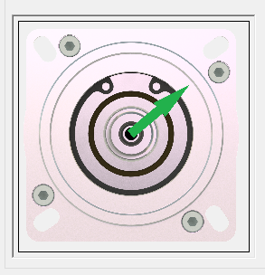

# Axis View

## Overview

The axis view displays the axis as a 2D graphic object.

If the module is online, the shaft is moved according to the [reference position](D-SE-0098257.html#D-SE-0098257__D-SE-0098257.2) of the drive.

EIO0000003994.04