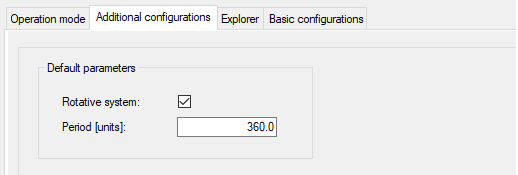

# Additional Configurations

## Overview

| Element | Description |
| --- | --- |
| Default parameters | The default parameters Rotative system and Period are used for several structure variables.  Rotative system:   * Homing touchprobe (*[PDL.ST\_HomeTp](../../../../../api/crossBook?lang=en-US&virtualBookName=PD.Lib.PacDriveLib&topicID=D_SE_0087740)*) * Homing sensor (*[PDL.ST\_HomeIn](../../../../../api/crossBook?lang=en-US&virtualBookName=PD.Lib.PacDriveLib&topicID=D_SE_0087730)*) * Homing move on position (*[PDL.ST\_HomeMoveOnPos](../../../../../api/crossBook?lang=en-US&virtualBookName=PD.Lib.PacDriveLib&topicID=D_SE_0087734)*)   Period:   * Homing restore (retain/encoder) (*AXM.ST\_HomeSetPos*) * Homing move on position (*[PDL.ST\_HomeMoveOnPos](../../../../../api/crossBook?lang=en-US&virtualBookName=PD.Lib.PacDriveLib&topicID=D_SE_0087734)*) * Endless (*AXM.ST\_EndlessFeed*) * Manuel (*[AXM.ST\_Manual](../../../../../api/crossBook?lang=en-US&virtualBookName=PD.Lib.AxisModule&topicID=D_SE_0077225)*) |

EIO0000003994.04