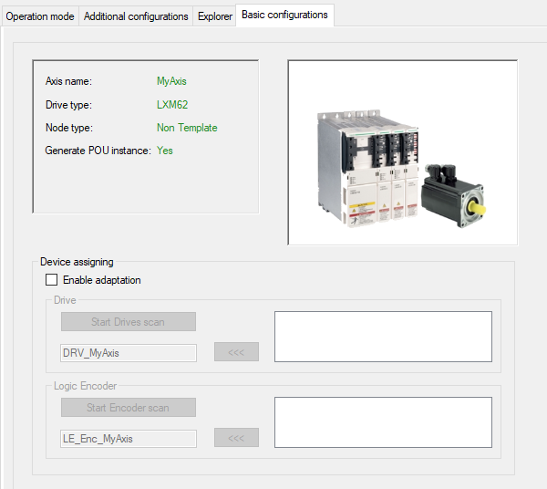

# Basic Configurations

## Overview

| Element | Description |
| --- | --- |
| Axis data | Displays the data of the selected axis. |
| Graphic | Displays a graphic of the selected axis. |
| Device assigning | Device assigning: Assigns devices to modules. |

## Device Assigning

To assign a device to a module, proceed as follows:

| Step | Action |
| --- | --- |
| 1 | Activate the check box Enable adaptation. |
| 2 | Click the Start Drives scan/Start Encoder scan button. |
| 3 | Select a device in the box below the Start Drives scan/Start Encoder scan button. |
| 4 | Assign the selected device to a module by clicking the <<< button beside the respective module. |

EIO0000003994.04