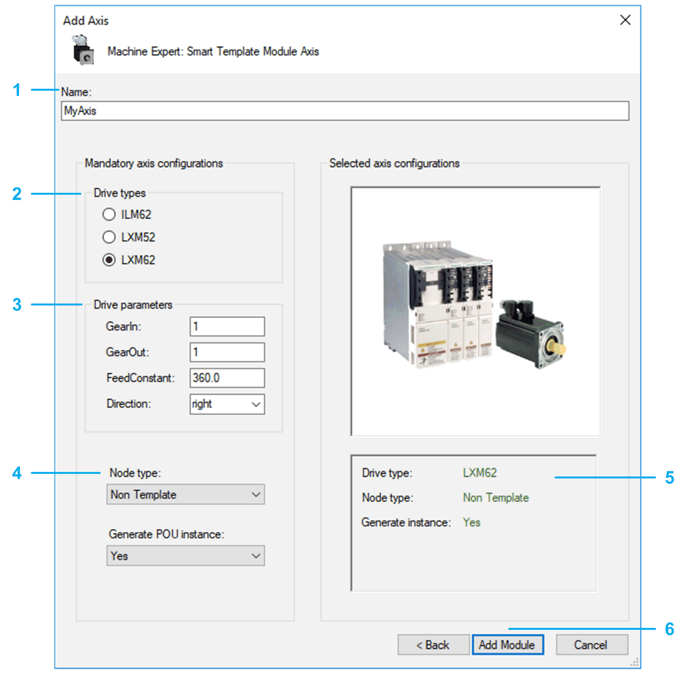

# Add Axis Dialog

## Dialog

| Step | Action |
| --- | --- |
| 1 | Select a Name for the axis. The created object and the created drive use this name. |
| 2 | Select the Drive type:   * ILM62 * LXM52 * LXM62 |
| 3 | Enter the Drive parameters:   * GearIn * GearOut * FeedConstant * Direction |
| 4 | Select the Node type:   * PacDrive 3 Template: The generated axis is prepared to be used with the PacDrive 3 Template. * Non Template: The generated axis can be used in other EcoStruxure Machine Expert software architectures without PacDrive 3 Template. |
| 5 | Verify the axis configuration. You cannot modify the configuration after leaving this dialog. |
| 6 | Confirm configuration. Use the Add Module button to add the configured axis to your project. The corresponding objects are displayed in the Modules view. |

EIO0000003994.04