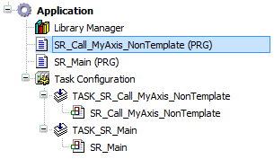
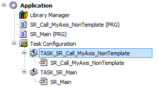
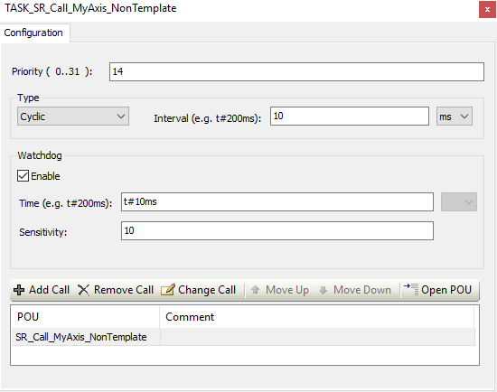
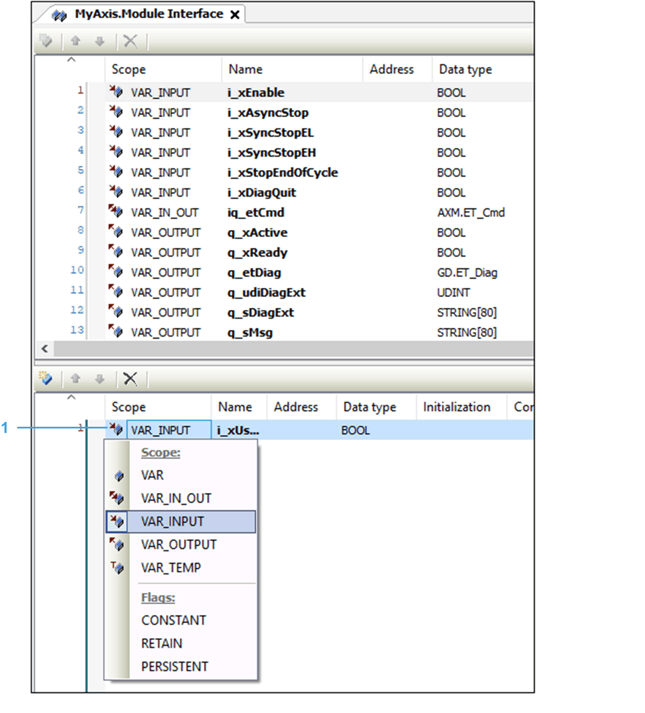
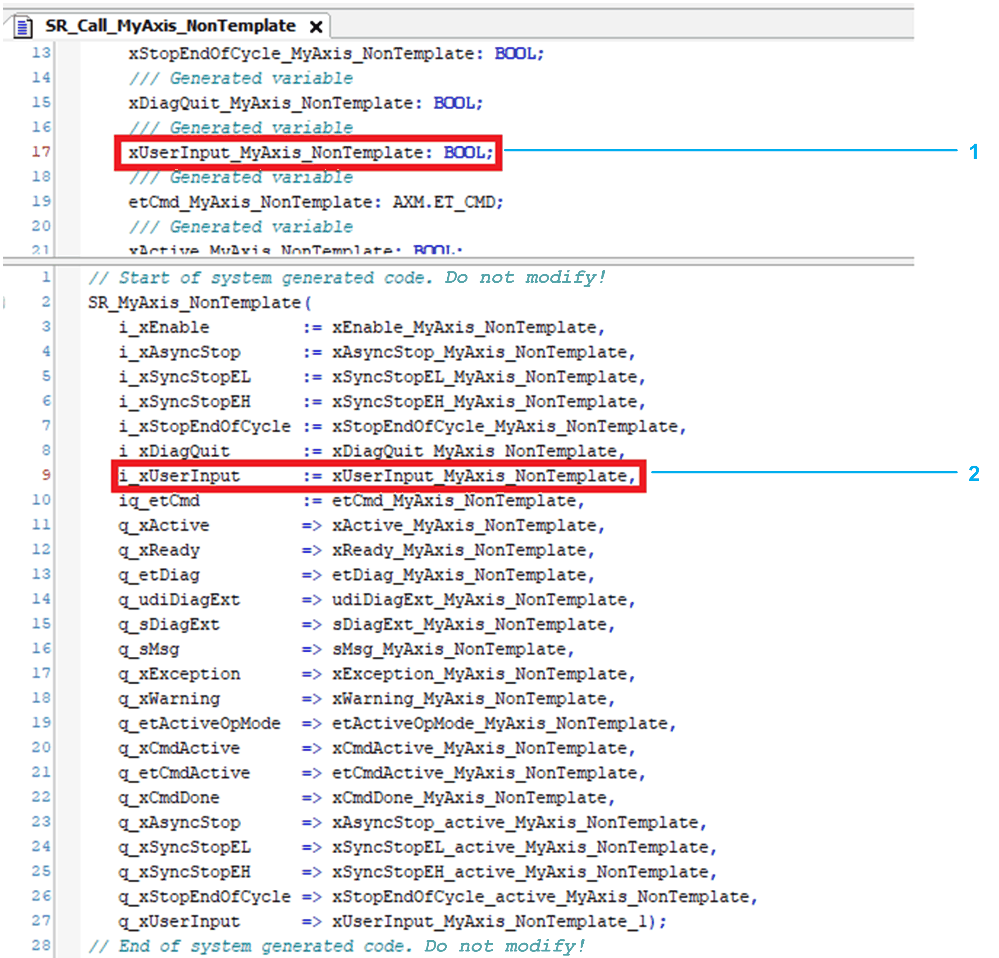
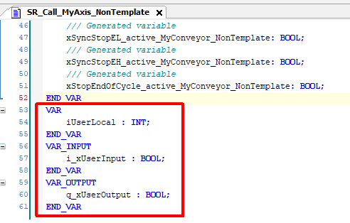
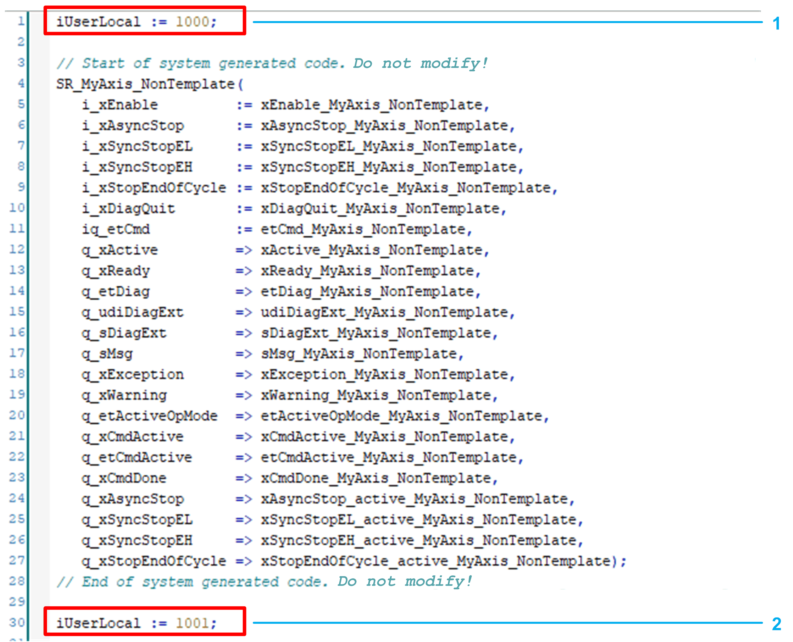
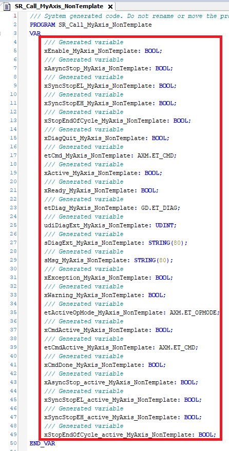
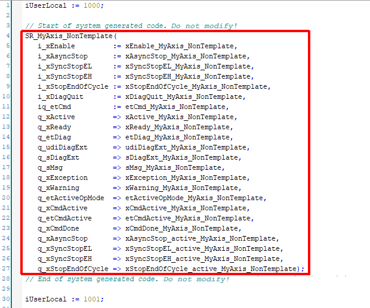

# Code Generation Option for Non Template Axes

## Generate POU Instances Option

With the Add Axis dialog, you can create a program and call the axis instance and its corresponding task automatically.

Adding a new Non Template axis node with code generation:

| Step | Action |
| --- | --- |
| 1 | For Node type, select Non Template. |
| 2 | For Generate POU instance, select Yes. |

## Generated POUs

If you select the Generate POU instances option, the three following elements are added to your project:

* A call program SR\_Call\_<Axis Name> (PRG) is added to your project.

  
* A corresponding task TASK\_SR\_Call\_<Axis Name> is added to your project.

  
* The POU call of the call program SR\_Call\_<Axis Name> (PRG) within the task is added to your project.

  

After the automatic generation procedure by the system, the project can be built and downloaded to the controller.

NOTE: Once an axis node has been added to the Module structure, the node type cannot be modified. For further information about using the code generation option, refer to chapter [Call Axis in Your Program](D-SE-0098266.html#D-SE-0098266).

## Trigger for Program Call Regeneration

The most efficient way to exchange data with the axis is via ModuleInterface.

For details, refer to [Data Exchange with ModuleInterface](D-SE-0098267.html#D-SE-0098267).

**Regeneration Trigger**

If you added / deleted variables within the ModuleInterface dialog and then entered the Configuration data object under <Axis Name>, the call program SR\_Call\_<Axis Name> (PRG) is regenerated with the modified ModuleInterface variables.

The regeneration procedure implies the following for the program SR\_Call\_<Axis Name> (PRG):

* Variable declaration is adapted because of adding / deleting variables (1).
* Call of axis is adapted because of adding / deleting variables (2).

## Adding User-Specific Code to the SR\_Call\_<Axis Name> Program

**Additional user-specific variables**

Define additional user-specific variables in the declaration part of the SR\_Call <Axis Name> program:

**Additional user-specific code**

Only integrate additional user-specific code in the body of the generated program call at the following positions:

* Before the generated code part (1) or
* After the generated code part (2)

## Restrictions Regarding Program Call Regeneration

Do not modify the system generated declaration and implementation of the code snippets.

This is essential for program call regeneration of the generated code.

Do not modify this generated variables block.

Do not modify this generated body block (including the two comment lines).

EIO0000003994.04