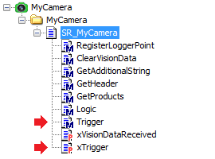

# SR\_<Camera Name> - Trigger (Method)

## Overview

|  |  |
| --- | --- |
| Type: | Method |
| Available as of: | V1.1.0.0 |

## Functional Description

The method is called automatically when the property xTrigger is set to TRUE.

You can add code to the method Trigger, for example to set an output to send a hardware trigger signal to a real camera via cable.

Then the code does not change whether you use a real camera or trigger the target generation.

EIO0000002757.09