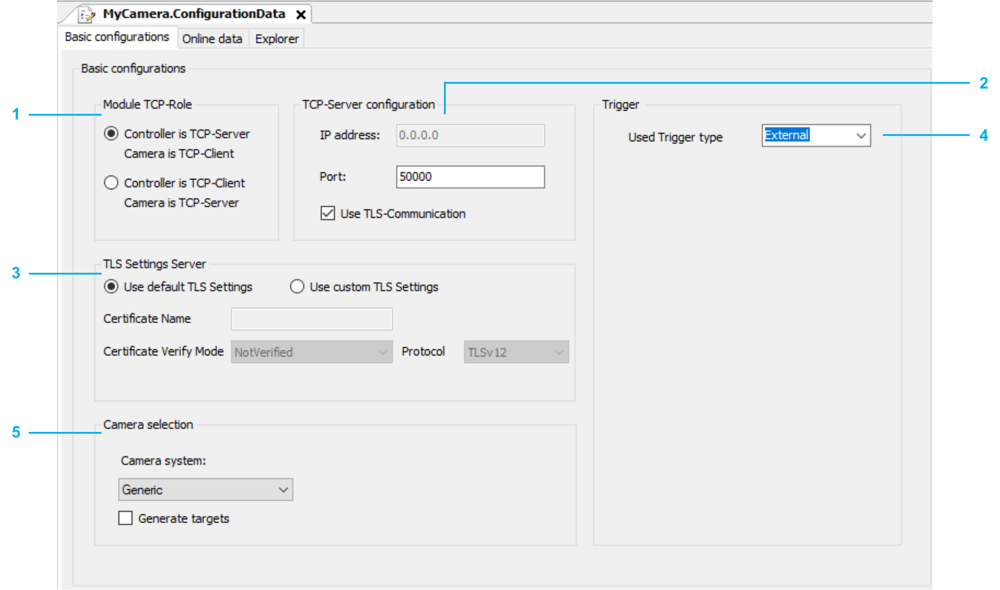

# Basic Configurations

## Basic Configurations Tab

This tab provides:

* To configure the communication parameters
* To select a camera
* To activate Generate targets

Example with Controller is TCP-Sever selected.

| Legend | Item |
| --- | --- |
| 1 | Module TCP-Role |
| 2 | TCP-Server configuration / TCP-Client configuration (depending on the selected Module TCP-Role) |
| 3 | TLS Settings Server / TLS Settings Client (depending on the selected Module TCP-Role) |
| 4 | Trigger |
| 5 | Camera selection |

## TLS Communication

The Use TLS-Communication check box is activated by default.

Always use the secured communication if your camera supports TLS-communication (Transport Layer Security).

If your camera does not support TLS-communication, you can deactivate the check box. If you deactivate the check box, a message is displayed and you are prompted to confirm establishing an unsecured communication.

## Module TCP-Role

You can select one of the following options for the Module TCP-Role:

* Controller is TCP-Sever. Camera is TCP-Client
* Controller is TCP-Client. Camera is TCP-Sever

Depending on the selected Module TCP-Role, you can define the corresponding:

* TCP configuration (TCP-Server configuration / TCP-Client configuration)
* TLS settings (TLS Settings Server / TLS Settings Client)

## TCP-Server configuration / TCP-Client configuration

* If you selected Controller is TCP-Sever for Module TCP-Role, you only need to enter the Port for the IP address.
* If you selected Controller is TCP-Client for Module TCP-Role, you need to enter the IP address of the camera and the Port used.

## TLS Settings Server / TLS Settings Client

* If you select Use default TLS Settings, you can not modify the settings. The settings used are described in the TcpUdpCommunication Library Guide:

  + [ST\_TlsSettingsServer](../../../../../api/crossBook?lang=en-US&virtualBookName=TcpUdpCo&topicID=D_SE_0095354)
  + [ST\_TlsSettingsClient](../../../../../api/crossBook?lang=en-US&virtualBookName=TcpUdpCo&topicID=D_SE_0095351)
* If you select Use custom TLS Settings, you can adapt the following settings to your needs:

  + Certificate Nmae
  + Certificate Verify Mode
  + Protocol
  + Hostname for SNI

## Trigger

The method Trigger is called with a rising edge of the property xTrigger. The property xTrigger can be set by you or by your program.

For Used Trigger type you can select on of the following options:

* External
* Timer
* Distance

External

If you select External, you must set the property xTrigger of the camera. Every time the variable is set to TRUE the method Trigger is called once.

Timer

If you select Timer, you must set the following timer parameters:

* Timer period [ms]: Time between two trigger signals. The value must be greater than Time trigger on, otherwise the value will not be accepted.
* Timer trigger on [ms]: Duration that the property xTrigger is set to TRUE. The value must be greater then 0 and less than Timer period, otherwise the value will not be accepted.

NOTE: You must evaluate if the selected values match the Task-cycle-time of the program. For example: If you have a Task-cycle-time of 10 ms, and a Time trigger on of 5 ms, the trigger will be on for 10 ms, and the Timer period will be at least 20 ms.

Distance

If you select Distance, you must set the following timer parameters:

* Distance period [mm]: Distance of the position source, between two trigger signals. The value must be greater than Trigger on distance, otherwise value will not be accepted.
* Trigger on distance [mm]: Distance that the property xTrigger is TRUE. The value must be greater than 0 and less than Distance period, otherwise value will not be accepted.
* Position phase offset [mm]: Trigger position shift. The value must be less than Distance period, otherwise value will not be accepted.
* Compensation time activation: Time compensation to activate the trigger signal.
* Compensation time deactivation: Time compensation to deactivate the trigger signal.
* Rollover value (Camera is a submodule of a RobotCell): Internal phase shift. The value is set automatically by selecting the TargetsHandler.
* Rollover value (Camera is not a submodule of a RobotCell): Internal phase shift. The value must be greater than 0, otherwise value will not be accepted.
* IEC name of position source (Camera is a submodule of a RobotCell): Position source for the trigger signal. The value is set automatically by selecting the TargetsHandler.
* IEC name of position source (Camera is not a submodule of a RobotCell): Position source for the trigger signal. You must set the value of the position source. To search for an axis, click the button Scan for position source, then select the axis that is used as position source.

## Camera selection

* Camera system
  + Generic

    If you select Generic, no IP address is needed.
  + COGNEX

    If you select COGNEX, an IP address is needed and the additional Cognex camera tab is displayed.

    Refer to [*General Information on Cognex Camera Configuration*](D-SE-0074181.html#D-SE-0074181__D-SE-0074181.3).
* Generate targets

  If you select Generate targets, the tab Generate targets is displayed.

  Refer to [*Generate targets*](D-SE-0081180.html#D-SE-0081180).

EIO0000002757.09