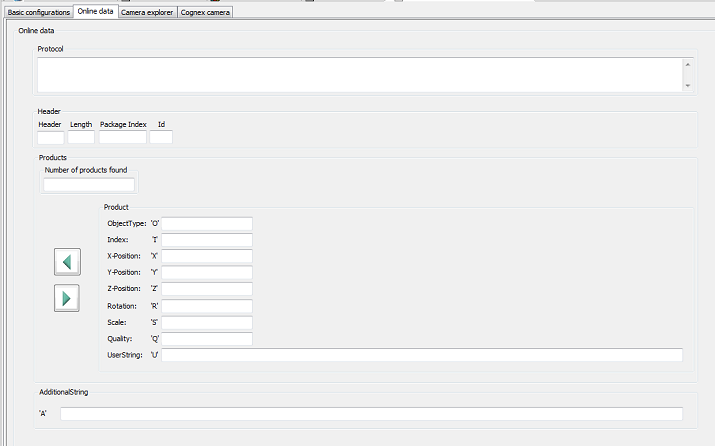

# Online Data

## Online Data Tab

This tab provides:

* To display the protocol
* To display the values of the single product information

| Element | Description |
| --- | --- |
| Protocol | Received protocol, split into several products.  Refer to [*Protocol Structure*](../../../../../api/crossBook?lang=en-US&virtualBookName=SERToolb&topicID=D_SE_0071320). |
| Header | Detailed information on the header of the protocol.  Refer to [*Header*](../../../../../api/crossBook?lang=en-US&virtualBookName=SERToolb&topicID=D_SE_0071325). |
| Products | * Number of products found * Product  Detailed information on the product.  Refer to [*Product Data*](../../../../../api/crossBook?lang=en-US&virtualBookName=SERToolb&topicID=D_SE_0071326). * Arrow buttons  Use these buttons to navigate through the products found. |
| Additional String | Additional string added at the end of the protocol.  Refer to [*Additional String*](../../../../../api/crossBook?lang=en-US&virtualBookName=SERToolb&topicID=D_SE_0071327). |

EIO0000002757.09