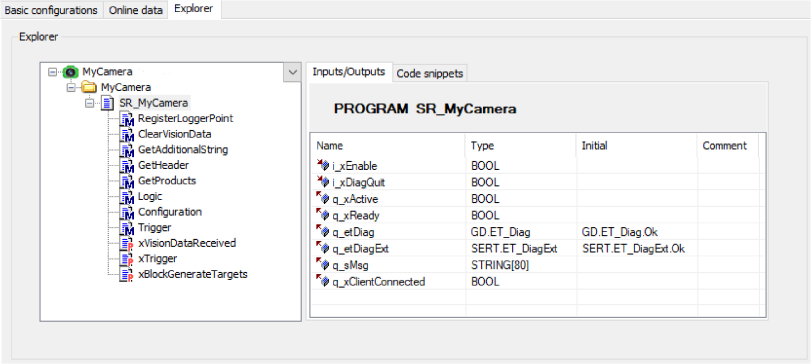

# Explorer

## Explorer Tab

This tab provides to display the software structure of the camera object.

| Element | Description |
| --- | --- |
| Interface tree (left-hand side) | Overview of the camera interface. |
| Inputs/Outputs tab | Detailed interface (inputs/outputs) of the item selected in the Interface tree. |
| Code snippets tab | Use the code snippets of this tab to copy-and-paste it to the desired location in your application code. |

EIO0000002757.09