# Generate Targets

## Overview

Based on the *[FB\_RandomTargetsGenerator](../../../../../api/crossBook?lang=en-US&virtualBookName=SERToolb&topicID=D_SE_0078895)* (SchneiderElectricRobotics Toolbox Library Guide) you can create Products/Targets. Instead of configuring/programming the FB\_RandomTargetsGenerator you can use the SmartTemplate user interface (GUI) to create random targets.

This is typically used for testing the motion logic with randomly generated targets, similar to a real application.

## Generate Targets Tab

This tab is displayed if you activate the Generate targets check box in the Basic configurations [tab](D-SE-0074050.html#D-SE-0074050).

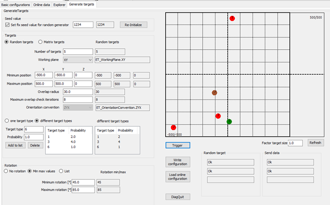

* The left-hand side (white background color) displays the user-defined configuration.
* The right-hand side (gray background color) displays the present online values used for the generation of the targets.

## Seed Value

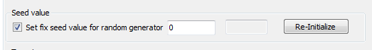

| Element | Description |
| --- | --- |
| Set fix seed value for random generator check box | * Check box activated: The given value is used as initial value for the random generator.  If the value is 0, the seed value is the present value of the CPU timer, using SystemInterface.FC\_GetTSC(). * Check box de-activated: The CPU timer is used. |
| Re-Initialize button | Click the button to reinitialize the random generator with the given seed and to restart the present random sequence. |

## Random Targets

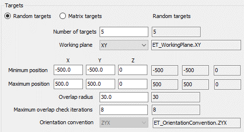

| Element | Description |
| --- | --- |
| Number of targets | Number of targets to be generated after a trigger event. |
| Working plane | Select a working plane, for example, XY, XZ, YZ (the position along the third axis is set to 0), and a rotation about a vector normal to the plane. |
| Minimum position | Minimum position value for the generated target. |
| Maximum position | Maximum position value for the generated target. |
| Overlap radius | Radius of a circle defined around each target. The targets are generated so that the circles do not overlap. |
| Maximum overlap check iterations | Maximum attempts to generate targets. After this number of iterations is exceeded, an error message is generated. |
| Orientation convention | Convention for the rotation angles of the orientation. |

## Matrix Targets

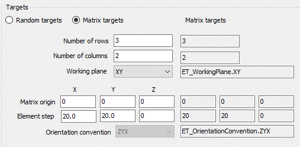

| Element | Description |
| --- | --- |
| Number of rows | Number of rows of the matrix of targets. |
| Number of columns | Number of columns of the matrix of targets. |
| Working plane | Select a working plane, for example, XY, XZ, YZ (the position along the third axis is set to 0), and a rotation about a vector normal to the plane. |
| Matrix origin | Position of the matrix origin. The targets are generated starting from this position. It must be contained in the selected working plane. |
| Element step | Position steps, along the X, Y and Z axes, used for the generation of the positions in the matrix. The value provided here must be compliant with the selected working plane. |
| Orientation convention | Convention for the rotation angles of the orientation. |

## One Target Type

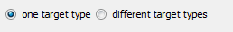

| Element | Description |
| --- | --- |
| One target type | Only one target type is used. In this case, target type 1 is used. |

## Different Target Types

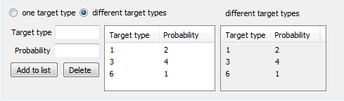

| Element | Description |
| --- | --- |
| Different target types | Several target types are used. |
| Target type | Sets the target type. Range: 1...10. |
| Probability | Probability for the target type to be generated.  Example above:   * Target type 1 has the probability 2/7 = 28.57% * Target type 3 has the probability 4/7 = 57.15% * Target type 6 has the probability 1/7 = 14.28% |
| Add to list | Adds a selected target type/probability pair to the list. |
| Delete | Removes a selected target type/probability pair from the list. |

## Rotation - No Rotation

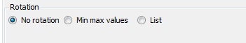

| Element | Description |
| --- | --- |
| No rotation | No rotation value is used. The rotation value for each target is 0. |

## Rotation - Min Max Values

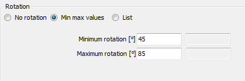

| Element | Description |
| --- | --- |
| Min max values | Minimum and maximum value for the rotation. The generated rotation values are randomly within this range. |

## Rotation - List

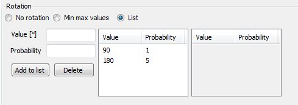

| Element | Description |
| --- | --- |
| List | List of up to 10 rotation value/probability pairs that a target type is randomly generated with. |
| Value | Rotation value. |
| Probability | Probability for the target type to be generated.  Example above:   * Rotation value 90 has the probability 1/6 = 16.67% * Rotation value 180 has the probability 5/6 = 83.33% |
| Add to list | Adds a selected rotation value/probability pair to the list. |
| Delete | Removes a selected rotation value/probability pair from the list. |

## Using the GUI (User Interface)

After entering a valid configuration, you can go online.

On the right-hand side (gray background color), the present values used on the logic motion controller are displayed.

You are informed if there are conflicts between the offline configuration parameters and the online values. If there are conflicts, you can choose if the online parameters are written to the offline parameter (Load online configuration) or if the parameters are written to the online project (Write configuration).

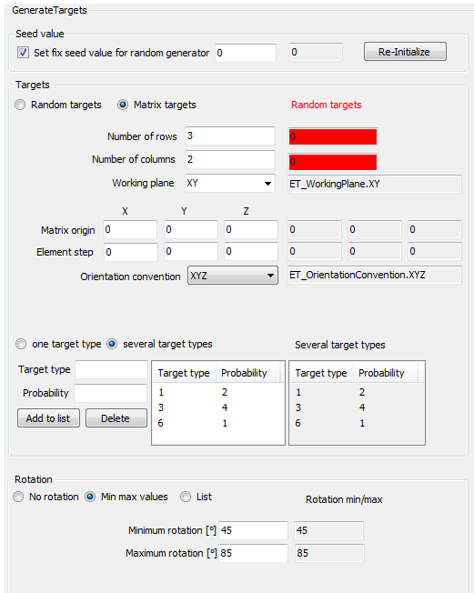

After entering a valid set of variables, being online and triggering (Trigger button) a new target generation, the generated targets are displayed and sent.

The targets can be read with the methods GetHeader, GetProducts, and so on.

## Displaying Generated Targets

The generated targets are displayed.

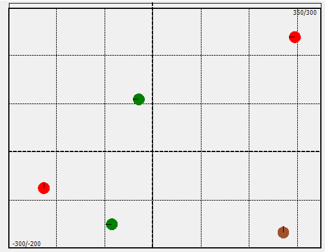

In case the displayed targets are not updated after a trigger event (Trigger button), the display can be manually refreshed with the Refresh button.

## Write Configuration / Load Online Configuration

If there is a conflict between the values you set (left side) and the values that run online on the controller, you can choose the values to be used for solving the conflict.

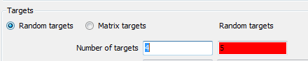

| Element | Description |
| --- | --- |
| Write configuration | Write the offline parameters to the online (left to right). |
| Load online configuration | Load the values that run online on the controller to the offline parameters (right to left). |

## Trigger Button

| Element | Description |
| --- | --- |
| Trigger button | Use this button to test the results of the present parameter set.   * Calls the method ClearVisionData. * Sets the property xTrigger to TRUE. |

## DiagQuit Button

| Element | Description |
| --- | --- |
| DiagQuit button | Use this button to quit the diagnostic messages, for example in case of invalid configuration without switching to the call of SR\_<Camera Name>. |

## Factor Target Size

The size of the displayed targets depends on the parameter Overlap radius or the parameter Element step.

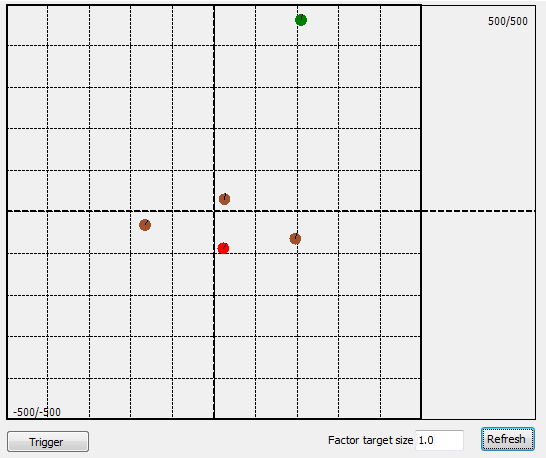

To scale the displayed targets, you can use Factor target size and click the Refresh button.

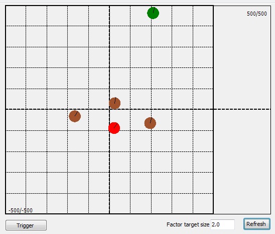

## State of the Generated Targets

The state / diagnostic of the internally used *[FB\_RandomTargetsGenerator](../../../../../api/crossBook?lang=en-US&virtualBookName=SERToolb&topicID=D_SE_0078895)* and *[FB\_SendVisionData](../../../../../api/crossBook?lang=en-US&virtualBookName=SERToolb&topicID=D_SE_0071266)* is displayed.

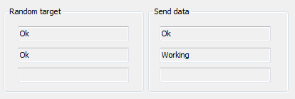

If the module is registered to the Application Logger (SR\_<Camera Name>.RegisterLoggerPoint()), log messages are sent to the Application Logger.

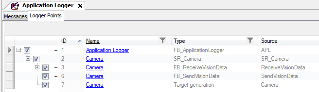

EIO0000002757.09