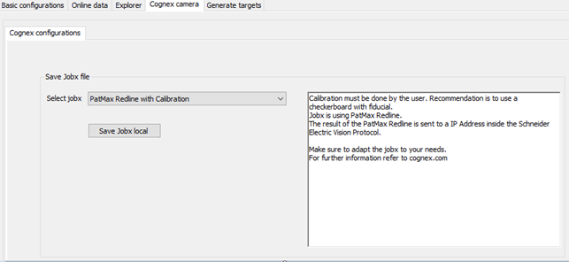

# Cognex Configuration

## Cognex Configuration Tab

You can save a copy of the prepared \*.jobx file to a selected folder with a given name.

| Element | Description |
| --- | --- |
| Save Jobx file | |
| Select jobx | Selects a job. |
| Save Jobx local button | Opens a file dialog box to save a copy of the prepared \*.jobx file. |

EIO0000002757.09