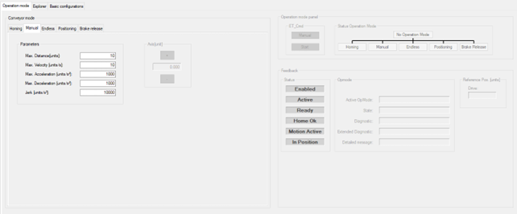

# Operation Mode - General

## Overview

Refer to the [*Smart Template Modules User Guide*](../../../../../api/crossBook?lang=en-US&virtualBookName=SmrtTplt&topicID=D_SE_0091270) for more information on displaying the different tabs.

The Operation mode tab provides three sections:

* [Conveyor mode](D-SE-0097945.html#D-SE-0097945)
* [Operation mode panel](D-SE-0097954.html#D-SE-0097954)
* [Feedback](D-SE-0097979.html#D-SE-0097979)

EIO0000003869.05