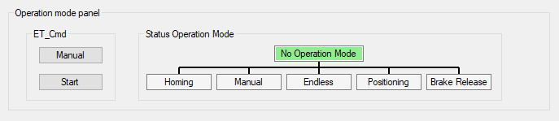

# Operation Mode Panel

## Overview

If the module is online, the Operation mode panel indicates the present operation mode.

Depending on the selected Conveyor mode [tab](D-SE-0097945.html#D-SE-0097945) (Homing, Manual, Endless, Positioning, Brake release), you can send the respective ET\_Cmd.

| Element | Description |
| --- | --- |
| ET\_Cmd | Depending on the selected Conveyor mode [tab](D-SE-0097945.html#D-SE-0097945), the upper button displays: Homing, Manual, Endless, Positioning, or Brake release.  Example:  If the module is not in the displayed operation mode (for example, Manual) click the Manual button to send the command *[AXM.ET\_Cmd.Manual](../../../../../api/crossBook?lang=en-US&virtualBookName=PD.Lib.AxisModule&topicID=D_SE_0077124)*, and then click the Start button to send the command AXM.ET\_Cmd.Start.  NOTE: Alternatively you can send the commands via the [ModuleInterface](D-SE-0097891.html#D-SE-0097891) (for example, iq\_etCmd).  If the Manual operation mode is accepted, the background color of the operation mode status Manual switches to green. |
| Status Operation Mode | Displays the operation mode of the module. |

EIO0000003869.05