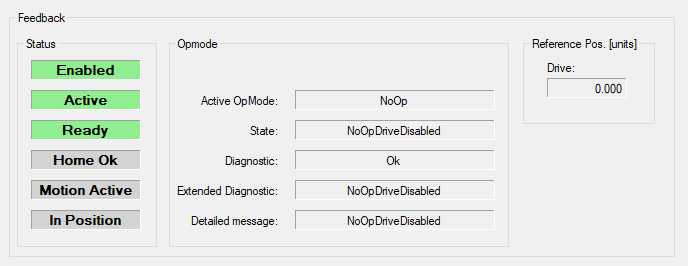

# Feedback

## Overview

If the module is online, several feedback values are displayed.

The feedback values are parameters provided by the following structures of the *[FB\_AxisModule](../../../../../api/crossBook?lang=en-US&virtualBookName=PD.Lib.AxisModule&topicID=D_SE_0077136)*:

* *[AXM.ST\_Main](../../../../../api/crossBook?lang=en-US&virtualBookName=PD.Lib.AxisModule&topicID=D_SE_0077223)* (PD\_AxisModule Library Guide)
* *[TPL.ST\_StandardModuleInterface](../../../../../api/crossBook?lang=en-US&virtualBookName=PD.Lib.Template&topicID=D_SE_0078570)* (PD\_Template Library Guide)

| Element | Description |
| --- | --- |
| Status | * Enabled  A green background color indicates that the module is enabled. * Active  A green background color indicates that the module is active. * Ready  A green background color indicates that the module is ready to operate and can accept user commands. * Home Ok  A green background color indicates that homing has been performed successfully. * Motion Active  A green background color indicates that the conveyor is moving.  Refer to *[AXM.ST\_ModuleInterface.ST\_Main.q\_xMotionActive](../../../../../api/crossBook?lang=en-US&virtualBookName=PD.Lib.AxisModule&topicID=D_SE_0077223)*. * In Position  A green background color indicates that the conveyor target position is reached.  Refer to *[AXM.ST\_ModuleInterface.stPos.q\_xInPosition](../../../../../api/crossBook?lang=en-US&virtualBookName=PD.Lib.AxisModule&topicID=D_SE_0077227)*. |
| OpMode | Diagnostics of the conveyor module. |
| Reference Pos. [units] | Reference Position of the conveyor axis. |

EIO0000003869.05