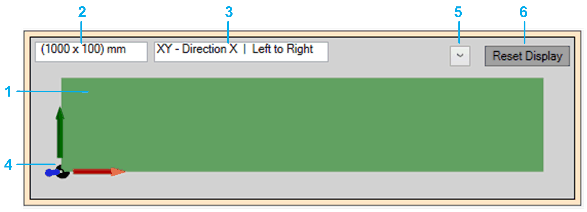

# Conveyor View

## Overview

The conveyor view displays the conveyor as a 3D graphic object.

Targets added via the property stTargets are displayed on the conveyor.

You can modify the display settings (5) of the conveyor view and the position and the viewing direction of the observer (camera) towards the conveyor (by mouse operations).

Conveyor view (default)

The default view (top down) shows the following items:

| Item | Description |
| --- | --- |
| 1 | Representation of the conveyor. |
| 2 | You can modify the Dimensions and the Display settings (Plane / Motion direction, OffsetX, OffsetY, OffsetZ, Mode) in the Additional configurations [tab](D-SE-0097992.html#D-SE-0097992). |
| 3 |
| 4 | Origin and coordinate axes of the conveyor representation. |
| 5 | Display options:   * Belt Dimension: Activate this check box to show the conveyor dimensions as configured in the Additional configurations [tab](D-SE-0097992.html#D-SE-0097992). * Display Settings: Activate this check box to show the display settings as configured in the Additional configurations [tab](D-SE-0097992.html#D-SE-0097992). * Reference Position: Activate this check box to show the drive reference position by a moving line. * Slider Product Size: Activate this check box to show a slider to control the size of the products. * Coordinate Axes: Activate this check box to show the origin and coordinate axes for the conveyor representation.   The activation/deactivation of an option becomes effective after the options menu is left.  By default, the options Belt Dimension, Display Settings, and Coordinate Axes are activated. |
| 6 | Reset Display button  If the conveyor has been moved and is not visible in the conveyor view, click the Reset Display to set the conveyor view to the default settings. |

## Mouse Operations

The position and the viewing direction of the observer (camera) towards the conveyor can be modified by mouse operations:

* Click and hold the left mouse button to pan the view (horizontal and vertical movement).
* Click and hold the right mouse button to rotate the view (longitudinal axis rotation).
* Use the mouse wheel to zoom the view(zooming in and out).

EIO0000003869.05