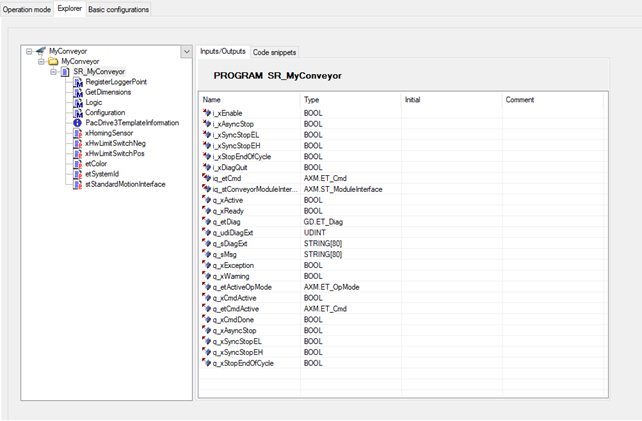

# Explorer

## Overview

The Explorer displays the software structure of the Conveyor-object.

| Element | Description |
| --- | --- |
| Interface tree | Overview of the available interface of the conveyor. |
| Inputs/Outputs | Detailed interface of the selected item. |
| Code snippets | Code snippets: Copy the code snippets of this tab to the desired location in your application code.   * Declaration snippet: Declaration of the variables * Implementation snippet: Implementation of the code   Detailed information can be found under: [*Call conveyor in your program*](D-SE-0097890.html#D-SE-0097890) in chapter Using the Module. |

EIO0000003869.05