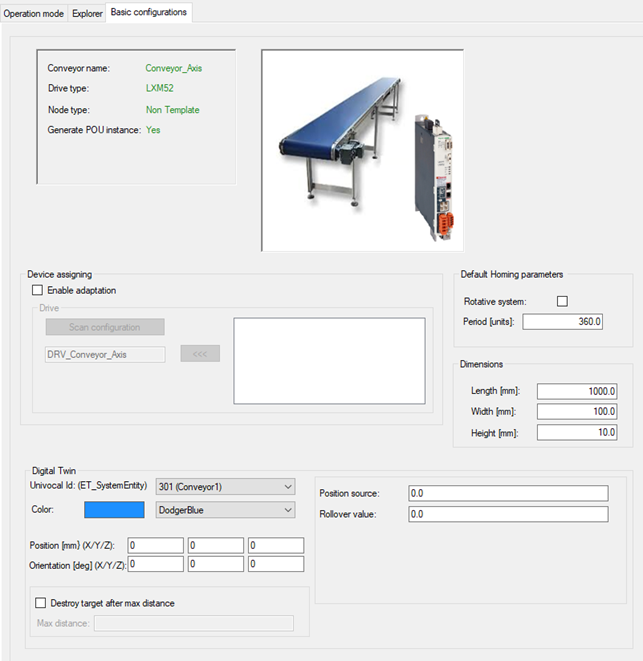

# Basic Configurations

## Overview

General

| Element | Description |
| --- | --- |
| Conveyor data | Displays the data of the selected conveyor. |
| Graphic | Displays a graphic of the selected conveyor. |

Device assigning

| Element | Description |
| --- | --- |
| Device assigning | Assigns devices to modules. For further information on how to proceed, refer to [Device Assigning](#D-SE-0098005__D-SE-0098005.4). |

Default Homing parameters

| Element | Description |
| --- | --- |
| Rotative system | The default parameter Rotative system is used for several structure variables.   * Homing touchprobe (*[PDL.ST\_HomeTp](../../../../../api/crossBook?lang=en-US&virtualBookName=PD.Lib.PacDriveLib&topicID=D_SE_0087740)*) * Homing sensor (*[PDL.ST\_HomeIn](../../../../../api/crossBook?lang=en-US&virtualBookName=PD.Lib.PacDriveLib&topicID=D_SE_0087730)*) * Homing move On position (*[PDL.ST\_HomeMoveOnPos](../../../../../api/crossBook?lang=en-US&virtualBookName=PD.Lib.PacDriveLib&topicID=D_SE_0087734)*) |
| Period | The default parameter Period is used for several structure variables.   * Homing restore (retain/encoder) (*[AXM.ST\_HomeSetPos](../../../../../api/crossBook?lang=en-US&virtualBookName=PD.Lib.AxisModule&topicID=D_SE_0077221)*) * Homing move On position (*[PDL.ST\_HomeMoveOnPos](../../../../../api/crossBook?lang=en-US&virtualBookName=PD.Lib.PacDriveLib&topicID=D_SE_0087734)*) * Endless (*[AXM.ST\_EndlessFeed](../../../../../api/crossBook?lang=en-US&virtualBookName=PD.Lib.AxisModule&topicID=D_SE_0077217)*) * Manuel (*[AXM.ST\_Manual](../../../../../api/crossBook?lang=en-US&virtualBookName=PD.Lib.AxisModule&topicID=D_SE_0077225)*) |
| Dimensions | Configures the dimensions of the conveyor (length, width, height). The dimensions can be read via the method SR\_<MyConveyor>.GetDimensions().  NOTE: The parameters for length/width/height are not verified against other parameters, for example stTargets or the position of the conveyor. |

Digital Twin - Conveyor Module not as submodule of RobotCell

| Element | Description |
| --- | --- |
| Univocal Id | Selects a unique ID for the conveyor. Ensure that the Univocal Id is unique for all conveyors used in one project that is connected to a Digital Twin. |
| Control mode | Not editable, is set to DTC.ET\_ConveyorControlMode.PositioningModuloRollover. |
| Color | Selects a color. |
| Position and Orientation | Sets the position and orientation to place the conveyor in the Digital Twin. |
| Position source | For the position source, you can use the position of a drive or encoder (LE\_Encoder.Position) or using an IEC variable of type LREAL. In the case of an IEC variable you must ensure that the variable is updated in time. |
| Rollover value | For the rollover value, a value that do not change during execution must be set, therefore either a fix value can be set or an IEC variable of type LREAL. |
| Destroy target after max distance | If the checkbox is selected, set a value for the maximum distance in the Digital Twin. |

Digital Twin - Conveyor Module as submodule of RobotCell

| Element | Description |
| --- | --- |
| Univocal Id | Selects a unique ID for the conveyor. Ensure that the Univocal Id is unique for all conveyors used in one project that is connected to a Digital Twin. |
| Control mode | Not editable, is set to DTC.ET\_ConveyorControlMode.PositioningModuloRollover. |
| Color | Selects a color. |
| Position and Orientation | Sets the position and orientation to place the conveyor in the Digital Twin. |
| Position source and Rollover value | For position source and rollover value, you can select between:   * A TargetsHandler that has been configured in the RobotCell module. Then the Position source and Rollover value are automatically referenced from the TargetsHandler. * Set Position source and Rollover value as IEC variables. For example, for Position source, you can use the position of a drive or encoder (LE\_Encoder.Position) or use an IEC variable of type LREAL. In the case of an IEC variable, ensure that the variable is updated in time. For Rollover value, a value that do not change during execution must be set, therefore either a fix value can be set or an IEC variable of type LREAL. |
|  |
| Destroy target after max distance | If the checkbox is selected, set a value for the maximum distance in the Digital Twin. |

NOTE: For structure variable METwin OPC UA Node, the name of the conveyor module is used.

NOTE: A good practice for Position source and Rollover value is to use SystemInterface.FCSetMasterEncoder to link a drive to a logical encoder. For the rollover value you can calculate a value by ((GearIn/GearOut) \* FeedConstant \* 212 \* 0.5) – 1.

## Device Assigning

To assign a device to a module proceed as follows:

| Step | Action |
| --- | --- |
| 1 | Activate the check box Enable adaptation. |
| 2 | Click the Scan configuration button. |
| 3 | Select a device in the box below the Scan configuration button. |
| 4 | Assign the selected device to a module by clicking the <<< button beside the respective module. |

EIO0000003869.05