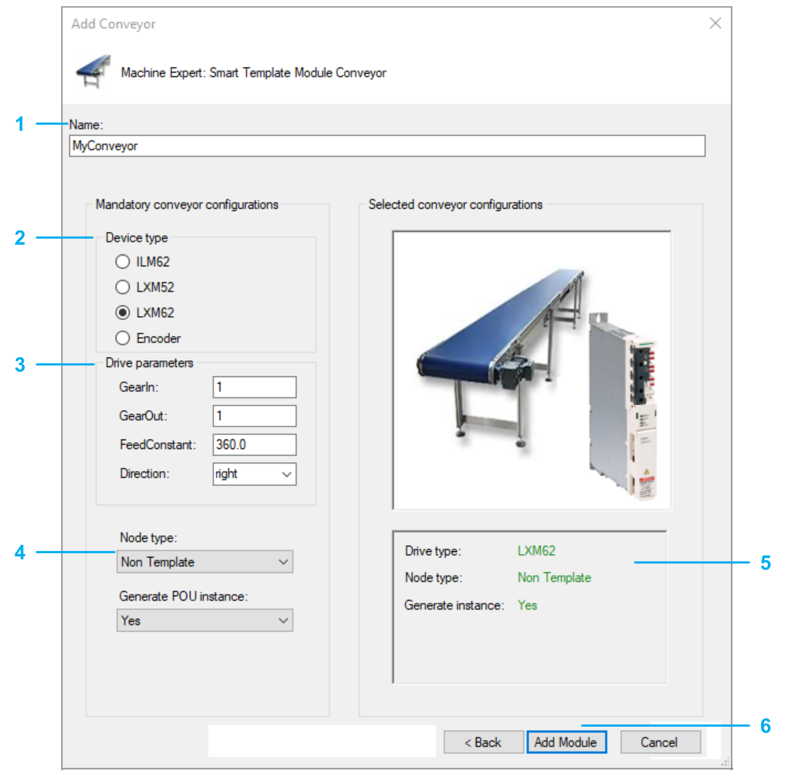
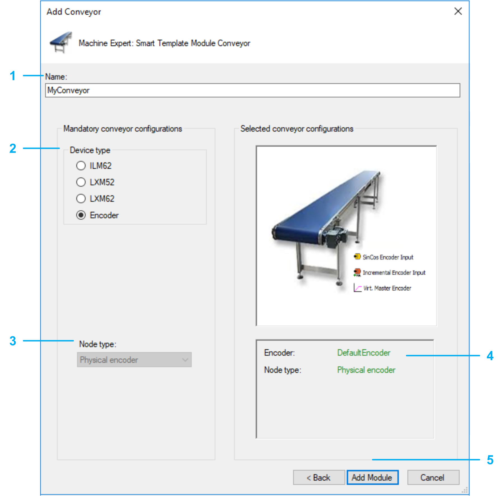

# Add Conveyor Dialog Box

## Dialog Box

The following dialog box is displayed in case of node type 'PacDrive 3 Template' and node type 'Non Template'.

| Step | Action |
| --- | --- |
| 1 | Select a Name for the conveyor. The created object and the created device use this name. |
| 2 | Select the Device type:   * ILM62 * LXM52 * LXM62 * Physical encoder (see below) |
| 3 | Enter the Device parameters:   * GearIn * GearOut * FeedConstant * Direction |
| 4 | Select the Node type:   * PacDrive 3 Template: The generated conveyor is prepared to be used with the PacDrive 3 Template. * Non Template: The generated conveyor can be used in other EcoStruxure Machine Expert software architectures without PacDrive 3 Template. |
| 5 | Verify the conveyor configuration. You cannot modify the configuration after leaving this dialog box. |
| 6 | Confirm configuration. Use the Add Module button to add the configured conveyor to your project. The corresponding objects are displayed in the Modules view. |

The following dialog box is displayed in case of node type Physical encoder.

| Step | Action |
| --- | --- |
| 1 | Select a Name for the conveyor. The created object and the created device use this name. |
| 2 | Select the Device type: Encoder |
| 3 | The Node type: Physical encoder is selected automatically. |
| 4 | Verify the conveyor configuration.  NOTE: You cannot modify the configuration after leaving this dialog box. To later modify the configuration you must delete and re-add the module. |
| 5 | Confirm the configuration. Use the Add Module button to add the configured conveyor to your project. The corresponding objects are displayed in the Modules view. |

EIO0000003869.05